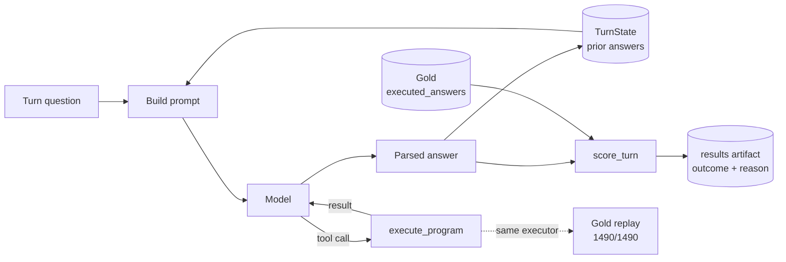

# ConvFinQA Report

## Running it

Three ways to run this, easiest first.

**1. No key, a replayed conversation:**

```bash
uv run main chat "Single_SLG/2013/page_133.pdf-4" --client fixture
```

No key, no network. These are 4 real answers from an earlier real call, played back through
the same `chat` interface — genuine recorded output, not staged data. The replay is a flat
lookup, though: it skips tool routing and the repair step, so it shows what the model said,
not the live reasoning path. Only `--client anthropic` exercises that.

**2. No key, the real pipeline with a predictor built to be wrong:**

```bash
uv run main eval --client stub
```

Runs the full pipeline — loader, executor, scorer — with a predictor that's wrong on every
turn by construction. Prints 0.0 accuracy, which is the point: a deliberately-wrong client
proves the scorer can actually report failure, not just success. It's the same check
`make eval-falsify` runs as part of the gate. No network call.

**3. With a key, a live conversation:**

```bash
uv run main chat <record_id>
```

Answers one record's questions for real, one turn at a time (enter to continue, `exit` to
stop). No key means one clean error line and exit 1, not a crash.

For accuracy on a sample instead of one conversation:

```bash
uv run main eval --client anthropic --split train --limit <N>
```

`--limit` is required — I never want real spend sized by accident. `--split dev` also
requires `--confirm-dev-run`, because dev gets scored once and I can't take that back — see
Method for why.

The full gate (`make check`) needs no key and no network.

## Method

I designed and froze the metric before any model call — everything below comes straight from
dev's own `executed_answers` and `turn_program` fields, zero spend, no model involved.

Here's one turn's path through the system. The same `execute_program` function that runs
every live calculator call is also what the 1490-point gold check runs — there's only one
implementation of the arithmetic, so it can't quietly disagree with itself.



**I used 0.1% relative tolerance.** Re-running all of dev's gold programs and comparing to the
recorded answers at different tolerances gives:

| tolerance | turns matching gold (of 1486) |
|---|---|
| exact (`==`) | 945 |
| 0.0001% | 1166 |
| 0.001% | 1317 |
| 0.01% | 1455 |
| 0.1% | 1486 (all of them) |
| 1% | 1486 (no change) |

The largest difference between a freshly-computed answer and gold's stored value was about
0.074%. 0.1% sits just above that with a small margin — tight enough to treat rounding noise
as correct without being loose, and going ten times looser (1%) doesn't accept a single turn
beyond what 0.1% already does.

Exact match alone reaches only 945 of 1486 (63.6%) — even a perfect answering system would be
capped there, because gold is stored at inconsistent precision (354 of 1486 values need five
or more decimal places to reproduce exactly). Reporting only exact match would make a storage
artifact look like a system failure, so I report strict (exact) and tolerant (0.1%) side by
side.

**Divide sometimes gives a ratio like 0.05, and the model sometimes reports it as 5 instead —
I decided not to score that as correct, only flag it.** In an experiment on 120 train turns
(top-level divide, gold between 0 and 1), 19 were wrong exactly this way under the original
prompt. Scoring both forms as correct would have roughly tripled accuracy on that
sample — 10/120 to 29/120 — without the model doing anything differently, which is a real
weakness I don't want to hide. It also turned out fixable: one added prompt sentence nearly
halved the rate, 19/120 to 11/120, a fix I'd never have found if both forms just scored
correct from the start.

The decision has a real cost: 352 of 1486 dev turns (23.7%) — every turn where the top-level
operation is divide and gold falls between 0 and 1, where this confusion is possible — have
their correctness riding entirely on the model getting the framing right, invisible unless
`scale_flip` is checked directly. (352, not the raw 411-turn magnitude bucket, since 59 of
those 411 aren't divide turns and can't have this confusion at all.)

**A third decision, on the same prompt instruction: I removed an exception I'd written into
it, because gold contradicted it.** The raw-ratio instruction above originally said "unless
the question explicitly asks for a percentage." That's wrong — gold reports a raw ratio even
when the question says "percent change." One dev turn asks exactly that
(`Single_CME/2010/page_113.pdf-1`, turn 1) and gold is `0.68381`, not `68.381`. Checking dev
directly: 369 of 1486 turns have a divide result between 0 and 1, and 206 of those (55.8%)
have a question containing "percent" or "%" — every one of those was wrong by construction
under the old instruction. That's 13.9% of the full denominator.

I removed the exception and re-ran the same 120-turn paired experiment. Tolerant-correct went
from 17.5% to 30.0%, `scale_flip` dropped from 9.2% to zero; 16 turns flipped from wrong to
right, 1 flipped from right to wrong — a paired significance test on that split gave
p=0.000275, a real difference. The one regression is named, not hidden:
`Single_GS/2018/page_68.pdf-1`, turn 4, gold `0.11873`, model answered `12.0` — a "percent"
question pulling it toward percentage form even after being told not to. I'd have made this
change even without the measurement: the exception was already wrong against gold. Per-turn
detail and spend are in the private process repository referenced in the disclosure below.

**I iterate on train, and score dev exactly once, at the end.** There's no third, held-out
split — just train (3037 records) and dev (421). The obvious move is to carve dev in half,
but that spends half of the only truly held-out data on iteration. Train has the same fields
and gold answers, at seven times the volume, and I checked that the two splits share no
source documents (1588 train, 218 dev, zero overlap), so iterating on train can't leak into
dev.

To be precise: no model predictions were scored against dev during development; dev gold
*was* used to validate the scoring method itself — the tolerance sweep and the 1490-point gold
replay both read dev's own fields directly, no model involved. Prompt iteration and both
percentage-convention experiments ran on train. Dev gets scored once, behind a
`--confirm-dev-run` flag the CLI enforces, because it's a split I can't un-spend.
## Error Analysis

**Everything below comes from a 47-turn, 12-conversation sample of train, not dev** — dev
hasn't been run yet (see Method). This is the best evidence available before that run, not a
substitute for it, and every number carries its own sample size.

**Two conversations account for half the wrong turns.** `Single_AMT/2010/page_98.pdf-2` got
all 4 turns wrong the same way — a consistent divide-by-20 error. `Single_PNC/2012/page_96.pdf-3`
got its opening lookup turn right, then every later turn wrong, from a subtraction done in the
reverse order gold uses. Counted by turn that's 16 separate failures; counted by conversation
it's two recurring bugs touching nearly every turn they appear in — which changes what "16
wrong turns" should mean to a reader.

Clustered by cause, reading all 16 individually (not just the machine-recorded `reason`
field, which only distinguishes `wrong_value` from `parse_error`):

| Root cause | Count | Share | Example (gold → predicted) |
|---|---|---|---|
| Sign flip — subtraction done in gold's reverse order | 5 | 31% | `Single_PNC…-3` t2: `16.0 → -16.0` |
| Unit/scale confusion — one conversation, all 4 turns ÷20 off | 4 | 25% | `Single_AMT…-2` t0: `205.4 → 10.27` |
| Scale-flip (×100), flagged by the scorer | 2 | 12.5% | `Double_REGN…` t0: `0.13082 → 13.08` |
| `parse_error` — no parseable answer after one repair | 2 | 12.5% | `Double_AAL…` t1: `0.00406 → None` |
| Scale-flip-shaped near-miss, just outside tolerance | 1 | 6.25% | `Double_CE…` t2: `0.01176 → 1.18` |
| Literal misread (off-by-one table read) | 1 | 6.25% | `Double_CE…` t1: `85.0 → 86.0` |
| Rounding near-miss (0.21% error, just above tolerance) | 1 | 6.25% | `Single_PPG…-4` t1: `-0.02355 → -0.0235` |

At n=16, each cluster is roughly 6 percentage points wide; the two largest clusters are the
two systematic conversations above, not nine independent occurrences.

**Re-characterization, added after this sample was measured.** The two `scale_flip` failures
happened under the older, flawed prompt described in Method, already fixed there (a 120-turn
re-run took `scale_flip` to zero) — best read as an already-fixed prompt bug, not a model
limit. I haven't re-run this specific sample under the fixed prompt, so I can't say what it
does to this sample's own 53.2%/66.0%.

**Overall on this sample:** 25/47 (53.2%) strict, 31/47 (66.0%) tolerant. No turns are
dropped — the eval runner checks the scored count against the expected count and raises if
they don't match.

**The divide-only subset is small — 11 turns — so the range around the number matters more
than the number.** 4 of 11 correct, 36.4%, with a 95% interval of roughly 15% to 65%. I'd
predicted this subset would move up from 17.5% toward a ceiling around 56% once `TurnState`
and the winning prompt were in place, and it did, to 36.4% — read that as the right direction,
not a precise number; one sample this size can't give both.

**Against the paper's three claims (FinQA, Section 5.3) — confirmed, refuted, or untested,
each on its own:**

1. *"The model excels at number selection questions."* Only 1 of the 16 wrong turns is a pure
   lookup miss — the rest all needed computation. Some evidence the model is better at finding
   numbers than computing with them, but I only looked at the failures, not a full
   lookup-vs-computed split across all 47 turns. Worth doing properly on dev, where it's free.
2. *"Later turns tend to be harder."* Untested here — I recorded turn index for the 16
   failures but not the 31 correct turns, so there's no by-turn-index accuracy to check this
   against. Dev's own numbers should answer it.
3. *"A wrong turn makes the next ones unlikely to be right."* Both systematic-error
   conversations fit this shape, but I didn't keep tool-call transcripts for those turns, so I
   can't tell a genuinely compounding error in `TurnState` from two separate bugs that happen
   to look the same from outside. Two of twelve conversations, half of all the misses —
   consistent with the claim, but it doesn't prove the mechanism.
## Limitations

**`scale_flip` only catches the ×100/÷100 case, not other unit mistakes.** One real example
(an earlier probe, slice 12) had the model answer in millions where gold was in billions — a
×1000 miss the flag doesn't catch, indistinguishable in the headline from any other wrong
answer. I didn't widen the check: the 352-turn exposure figure is a decision I've frozen, and
widening the detector on one observed case would reopen it without knowing how often the
broader problem actually happens.

**Nothing in the gate checks that `src/services` never imports a concrete `src/adapters`
class directly, and that gap produced a real bug.** I considered `import-linter` early on and
skipped it for budget. Not theoretical: `eval_falsify_check.py` imported `StubClient`
directly, exactly what that check exists to catch, and nobody noticed until I found it by
hand while writing this section. Fixed the one instance (see the disclosure below); the gap
that let it happen is still open, named in Future Work with its own cost.

## Future Work

Each of these was a decision, made with a stated reason, not something the deadline forced on
me silently.

**Out of scope by design:** retrieval or a vector store (each record ships its own document, so
cross-document retrieval isn't the problem here, and adding one is the most common way to
over-build this task); fine-tuning; program synthesis (the brief asked for tool-calling
instead); multiple agents; a web interface; a second model provider; state kept between
processes; Repository/Unit-of-Work/message-bus/CQRS (no database, no concurrency — these would
be over-engineering, not sophistication).

**Named gaps:**
- `scale_flip`'s ×100/÷100-only limit — see Limitations. Worth measuring properly on dev.
- `eval_runner` reads token-count fields off `AnthropicClient` that aren't declared on the
  `ModelClient` interface — harmless with today's two clients, but a future client with a
  different shape would silently report zero cost.
- The by-turn-index and lookup-vs-computed splits are both free, from data already collected,
  but I didn't compute them this session — only read the 47-turn sample's failures by hand.
  Natural next step, on dev.
- Adding `import-linter` is a bigger job than the one violation it would have caught justifies
  this late — setting up the rule, running it against the whole tree, and fixing whatever else
  it surfaces (unknown until run) is real, uncosted work.
- The keyless demo covers one conversation. A few more would make it more representative — not
  done because one clean example already shows the mechanism, and each one is a real recorded
  conversation, not free data.

**What's left:** the dev split, scored once, and this report's numbers filled in against it —
see Method for why that hasn't happened yet. That run, a polish pass, and the PR are what's
left, not more design work.

## AI-tool disclosure

I built this with Claude Code, using my own tooling for running coding agents against a
deadline — a hook that blocks specific dangerous commands, a work ledger, and a checkpoint
after every small increment. That tooling lives in a separate private repository and isn't
part of this submission. I'm describing it as a process, not a disclaimer: naming its limits
honestly tells a reviewer more than a clean story would.

**The numbers, checked against the ledger and git, not recalled.** 27 slices across 3
sessions — 26 landed as commits, one reverted before any file was written and redone under
the next number. 28 commits on this branch for that work, plus an occasional follow-on commit
for a fix that surfaced right after landing (noted individually, not folded into a later
diff) — `git rev-list --count main..HEAD` gives the live figure, since it keeps growing before
submission. The gate ran green before every one of those commits; I re-ran it myself each
time, never took a subagent's word for it. `PROCESS.md` has the full slice-by-slice ledger.

**Why the sessions ran in that order.** Session 1 built the pieces that measure accuracy
before spending any money on a model call, so the metric couldn't get bent to fit a result
I'd already seen. Session 2 built the agent and got the first real numbers, on train only —
every question its behavior raised needed answering on data I could re-spend, before touching
dev. Session 3 wrote this report from what train had already shown, without running dev yet:
writing first means the report wasn't shaped around a number after seeing it.

**What I delegated, and what I didn't.** Scoped, pre-defined pieces — the executor, the
scorer, the adapter, CLI wiring, and their tests — went to a subagent per slice, given an
intent, a file list, and a check command, nothing more. I kept the metric itself (the
tolerance, the scale-flip rule, the train/dev split), the plan, and every checkpoint
verification. Nothing was marked done on a subagent's own report — I re-ran the gate and read
the diff before every commit.

**The controls, concretely.** A pre-tool-use hook blocks specific dangerous commands outright
(recursive force-deletes, history-rewriting git operations, pushes) rather than asking an
agent not to run them. It fired twice for real: once denying a recursive force-delete
(`BLOCKED: ... use targeted deletes, not recursive force. Ask the human if you truly need
it.` — I renamed the target instead), and once stopping the first write past a session's soft
deadline until I'd posted where things stood and cut scope. Each slice is its own commit,
gate green before the next starts. A separate reviewer role reads diffs and reports findings
by severity, never edits code, never grades its own work. The ledger tracks planned vs. actual
time per slice, so drift is visible rather than asserted.

**What the controls actually caught:**
- A guard I'd just written let `--limit -1` through — Python treats a negative limit as "from
  the end," not "no records," silently pulling nearly the entire train split. The reviewer
  found it on an adversarial pass, I reproduced it live, and killed the run after 46 real
  calls before fixing it.
- A docstring said an error type would always propagate uncaught; a handler was added hours
  later without updating it. The engineer building the next piece noticed the mismatch while
  reading the existing code.
- An early draft had the service layer import a concrete adapter class directly instead of its
  interface. Caught reading the diff before checkpointing — not the reviewer, not invoked on
  that slice — so it never shipped.
- An earlier draft of this report claimed the keyless demo used "the same tool loop" as the
  live client. Not true — it's a flat lookup. Caught on review, checked against the source,
  rewritten.

**What went wrong, disclosed rather than hidden.** Early on I found that a subagent's
self-reported start/finish time wasn't reliable — twice, including once where the reported
finish time was later than when the next task actually started. Both are marked
`estimated: true` in the ledger and excluded from the timing numbers rather than quietly
fixed. From then on, timestamps came from my own clock, never a subagent's report.

**A defect found while writing this section, and fixed, not just disclosed.** Tracing the
layering violation above turned up a second, uncaught instance of it in a different module.
Fixed the same way — inject the interface, move the concrete import to the script's entry
point, add the module's first test.

**Honest limits.** The guard blocks specific command patterns; it can't see inside what a
subagent does with a shell command or a file it's allowed to touch. Most of this codebase
wasn't hand-written — subagents implemented it against a spec, checked at commit boundaries,
not authored line by line. The parts I read and reasoned through myself in full — the
executor, the scorer and tolerance policy, the gold-replay test, `TurnState`'s design and its
cross-turn risk — are the parts I can defend line by line. The API plumbing, the CLI wiring,
and most of the tests were reviewed at checkpoints, not read that closely, and I'd say so if
asked about a specific line I hadn't actually traced.
