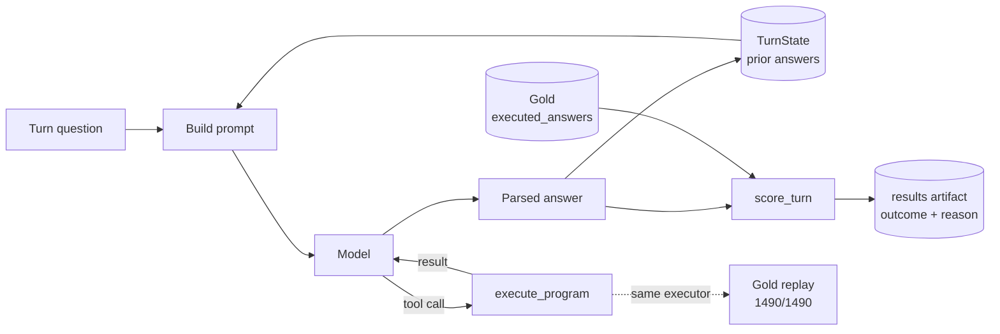

# ConvFinQA Report

## Running it

**Three ways to run this, from easiest to most advanced:**


**1. No key, a replayed conversation:**

```bash
uv run main chat "Single_SLG/2013/page_133.pdf-4" --client fixture
```

No API key or internet connection needed.

* Replays 4 real answers from an earlier model run through the same `chat` interface.
* These are genuine recorded outputs, not made-up examples.
* Replay mode is only a simple lookup. It does not run tool routing or the repair step.
* To test the full live reasoning and tool-calling flow, use `--client anthropic`.


**2. No key, the real pipeline with a predictor built to be wrong:**

```bash
uv run main eval --client stub
```

Runs the full pipeline without using the network.

* Tests the loader, executor, and scorer together.
* Uses a deliberately wrong predictor for every question.
* The expected accuracy is `0.0`.
* This confirms the scorer can detect failure, not just report successful results.
* This is the same check used by `make eval-falsify`.


**3. With a key, a live conversation:**

```bash
uv run main chat <record_id>
```

Runs one real record, one question at a time.

* Press **Enter** to continue to the next question.
* Type `exit` to stop.
* With an API key, it runs the questions through the live pipeline.
* Without a key, it prints one clear error message and exits cleanly with code `1` instead of crashing.


For accuracy on a sample instead of one conversation:

```bash
uv run main eval --client anthropic --split train --limit <N>
```

Safety checks prevent accidental API spend or unintended dev scoring.

* `--limit` is always required, so you must choose how many records to run.
* Running with `--split dev` also requires `--confirm-dev-run`.
* This protects the dev set because it should only be scored once.
* `make check` runs the complete validation gate with no API key or network access.
* `docs/TESTING.md` contains the full manual test record from a fresh clone, including exit codes and guard failures.


## Method

I designed and froze the scoring metric **before making any model calls**.

Everything used to define the metric came directly from the dev set's `executed_answers` and `turn_program` fields. That meant **zero API spend and no model involvement** while defining the evaluation.

For each question, the system follows the same path:

1. Take the current question.
2. Build a prompt using:
   - the financial document
   - the current question
   - Claude's previous answers stored in `TurnState`
3. Claude decides what calculation is needed.
4. If maths is required, Claude calls the deterministic Python `execute_program` tool.
5. The tool result is returned to Claude.
6. Claude produces its final answer.
7. The application parses that answer.
8. `score_turn` compares the parsed prediction with the dataset's gold answer.
9. The result and failure reason are saved.
10. Claude's parsed answer is added to `TurnState` for the next question.

The same `execute_program` function is also used to replay all **1,490 gold programs** during offline validation. So there is only one arithmetic implementation used both by the live agent and by the benchmark check.

> **The production tool path and the gold-replay validation path use exactly the same executor. This prevents me from validating one arithmetic implementation while deploying another.**

## 1. Turn question

This is simply the current question in the conversation.

For example:

```text
What was the percentage increase in revenue?
```

The question may depend on answers from earlier turns.

## 2. `TurnState` prior answers

`TurnState` is the conversation memory.

For example:

```text
Q1: What was 2021 revenue?
Claude: 100

Q2: What was 2022 revenue?
Claude: 120
```

`TurnState` stores those previous **Claude answers**.

Importantly, it stores what Claude actually predicted, not the correct answer from the dataset.

If Claude incorrectly answered:

```text
110
```

then the next question sees `110`, not the gold answer.

This keeps the evaluation realistic.

> **"I don't repair the conversation with gold answers between turns, because production wouldn't have access to the answer key."**

## 3. Build prompt

The prompt combines everything Claude needs:

```text
financial document
+ system instructions
+ previous model answers
+ current question
```

Conceptually:

```text
TurnState --------\
                   > Build prompt -> Claude
Current question -/
```

The previous answers are therefore carried forward into later turns.

## 4. Claude

Claude is mainly responsible for **reasoning**, not arithmetic.

It needs to:

- understand the question
- find the relevant numbers
- understand references to earlier questions
- decide what calculation is required
- call the calculator when needed

For example:

```text
Question:
What percentage of 400 is 100?
```

Claude should recognise that it needs something equivalent to:

```text
divide(100, 400)
```

## 5. `execute_program`

`execute_program` is the deterministic Python arithmetic layer.

The flow is:

```text
Claude
  |
  | tool call
  v
execute_program
  |
  | result
  v
Claude
```

For example, Claude requests:

```text
divide(100, 400)
```

Python returns:

```text
0.25
```

Claude then uses that result to produce the final answer.

The easiest sentence to remember is:

> **Claude decides what maths to do. Python actually does the maths.**

## 6. Why the tool result goes back to Claude

Tool calling works as a loop.

For example:

```text
Claude:
"I need divide(100, 400)."

        ↓

Python:
0.25

        ↓

Claude:
"ANSWER: 0.25"
```

Claude sees the result before producing its final response.

## 7. Parsed answer

Claude may produce text such as:

```text
The result is 0.25.

ANSWER: 0.25
```

The application extracts:

```text
0.25
```

That becomes the model's structured **prediction**.

So:

> **prediction = the answer Claude actually produced**

## 8. Gold `executed_answers`

The gold answer is simply the **official expected answer from the dataset**.

For example:

```text
Model prediction:
0.25

Gold answer:
0.25
```

The important point is that the gold answer is **never sent to Claude**.

It only enters the system when scoring:

```text
prediction -----\
                 > score_turn
gold answer ----/
```

This is similar to a unit test:

```text
actual   = model_answer
expected = gold_answer
```

Then the system compares them.

## 9. `score_turn`

`score_turn` acts as the examiner.

It receives:

```text
Claude's prediction
+
the expected gold answer
```

and decides whether the result is:

```text
correct
wrong_value
parse_error
scale_flip
```

It also applies the numerical tolerance rules.

For example:

```text
Gold:
12.34

Prediction:
12.341
```

The scorer checks whether that difference falls within the allowed tolerance.

## 10. Results artifact

Instead of saving only one overall number such as:

```text
75.84% accuracy
```

the system keeps information for every turn.

For example:

```text
record_id
turn
gold
prediction
correct
reason
scale_flip
```

This makes error analysis possible.

Instead of only asking:

> How many questions failed?

I can also ask:

> Why did they fail?

## 11. The prediction goes back into `TurnState`

After each turn:

```text
Claude prediction
       ↓
   TurnState
```

That answer becomes context for the next question.

For example:

```text
Turn 1:
Claude says 100
       ↓
stored in TurnState

Turn 2:
prompt includes the previous answer 100
```

Again, the gold answer is never inserted into the conversation.

This preserves realistic error propagation.

## 12. Gold replay: 1,490 / 1,490

The gold replay is a **separate offline validation step**.

It is not part of answering questions.

Conceptually:

```text
OFFLINE VALIDATION

Gold programs
     ↓
same execute_program
     ↓
compare with known answers
     ↓
1,490 / 1,490 accepted
```

The dataset already contains known calculations.

For example:

```text
divide(100, 4)
```

with expected result:

```text
25
```

I replayed those known programs through my executor and checked that the outputs matched the dataset.

## 13. Why "same executor" matters

I did not create one arithmetic engine for testing and another for live use.

That could create a situation like this:

```text
Test executor works correctly
Production executor contains a bug
```

Instead, both paths use:

```text
execute_program
```

Conceptually:

```text
Claude tool calls
       ↓
execute_program
       ↑
Gold replay
```

So the benchmark is validating the actual arithmetic code used by the agent.

## Full example

Suppose the question is:

> **"What percentage of 400 is 100?"**

The full flow is:

```text
CURRENT QUESTION
"What percentage of 400 is 100?"

        ↓

BUILD PROMPT
document
+ question
+ previous Claude answers

        ↓

CLAUDE
decides division is needed

        ↓

TOOL CALL
divide(100, 400)

        ↓

PYTHON EXECUTOR
0.25

        ↓

CLAUDE
ANSWER: 0.25

        ↓

PARSER
0.25

        ↓

SCORER
prediction = 0.25
gold       = 0.25

        ↓

RESULT
correct

        ↓

TURNSTATE
store 0.25 for the next question
```

At the same time, the executor is validated independently:

```text
KNOWN DATASET PROGRAMS
        ↓
same Python executor
        ↓
compare with expected answers
        ↓
1,490 / 1,490 accepted
```

## What the architecture proves

### 1. Claude reasons, Python calculates

```text
Claude = judgement and interpretation
Python = deterministic arithmetic
```

### 2. Gold answers cannot leak into Claude

Gold enters only at:

```text
score_turn
```

It never enters:

```text
Build prompt
```

### 3. Conversation state contains predictions, not gold answers

That means mistakes can naturally affect later turns, just as they would in a real conversational system.

### 4. The arithmetic implementation is independently checked

The exact executor used for Claude's calculator calls was replayed against all 1,490 benchmark calculations.

That gives one consistent arithmetic path for both live execution and validation.



Below is a simpler version that keeps the **exact numbers, examples, filenames, and important technical decisions**, but removes a lot of the dense wording. 

# Method

## Why I used 0.1% relative tolerance

I chose **0.1% relative tolerance** before making any model calls.

I tested the dev set's own gold programs against its stored answers at different tolerances:

| Tolerance    | Turns matching gold (of 1486) |
| ------------ | ----------------------------: |
| exact (`==`) |                           945 |
| 0.0001%      |                          1166 |
| 0.001%       |                          1317 |
| 0.01%        |                          1455 |
| 0.1%         |                          1486 |
| 1%           |                          1486 |

The biggest difference between a freshly calculated answer and the stored gold answer was about **0.074%**.

So **0.1%** was a natural cutoff:

* it accepts all **1486** valid gold calculations
* it sits just above the largest observed rounding difference
* increasing it tenfold to **1%** accepts no additional answers

This means 0.1% is loose enough to ignore harmless rounding differences, but not unnecessarily loose.

Exact matching alone only works for **945 of 1486 answers, or 63.6%**.

That happens because gold answers are stored with inconsistent precision. In fact, **354 of 1486 values need five or more decimal places** to reproduce exactly.

So I report both:

* **strict accuracy**, exact numerical match
* **tolerant accuracy**, using 0.1% relative tolerance

Otherwise, a storage-format issue would look like a model failure.

---

# Ratio versus percentage errors

A divide operation can return a ratio such as:

```text
0.05
```

But the model may answer:

```text
5
```

because it interprets the result as 5%.

I decided **not to count that as correct**.

Instead, I flag it as:

```text
scale_flip
```

In an experiment on **120 train turns** where:

* the top-level operation was divide
* gold was between 0 and 1

there were **19 scale-flip errors** under the original prompt.

If I had accepted both forms as correct, accuracy would have jumped from:

```text
10/120
```

to:

```text
29/120
```

without the model actually improving.

That would hide a real weakness.

A small prompt change helped. Adding one sentence reduced the problem from:

```text
19/120
```

to:

```text
11/120
```

That improvement would have been invisible if I had simply counted both forms as correct.

---

# Why this decision matters

There are **352 of 1486 dev turns, or 23.7%**, where:

* the top-level operation is divide
* gold is between 0 and 1

These are the turns where ratio-versus-percentage confusion can occur.

The raw magnitude bucket contains **411 turns**, but **59 of those 411 are not divide turns**, so they cannot have this particular problem.

That is why the real exposure is:

```text
352
```

not:

```text
411
```

---

# A prompt rule I removed

My original prompt said to return the raw ratio:

> unless the question explicitly asks for a percentage.

That rule turned out to be wrong.

The ConvFinQA gold answers sometimes use a raw ratio even when the question says "percent".

For example:

```text
Single_CME/2010/page_113.pdf-1
turn 1
```

The gold answer is:

```text
0.68381
```

not:

```text
68.381
```

I checked dev directly.

There are **369 of 1486 turns** where divide produces a value between 0 and 1.

Of those, **206, or 55.8%**, contain either:

```text
percent
```

or:

```text
%
```

Under my old prompt instruction, all **206** would be pushed toward the wrong representation.

That is **13.9% of the full dev denominator**.

So I removed the exception.

---

# What happened after removing it

I repeated the same **120-turn train experiment**.

Tolerant accuracy changed from:

```text
17.5%
```

to:

```text
30.0%
```

`scale_flip` dropped from:

```text
9.2%
```

to:

```text
0%
```

At the turn level:

* **16 turns** changed from wrong to right
* **1 turn** changed from right to wrong

The paired significance test gave:

```text
p = 0.000275
```

So this was a meaningful improvement.

There was one regression:

```text
Single_GS/2018/page_68.pdf-1
turn 4
```

Gold:

```text
0.11873
```

Model:

```text
12.0
```

The question used the word "percent", which still pulled the model toward percentage form.

I would have made the prompt change even without the experiment, because the old rule clearly contradicted the benchmark.

---

# Train versus dev

I iterate on **train** and score **dev once, at the end**.

The dataset contains:

```text
train: 3037 records
dev:    421 records
```

There is no third held-out split.

I could have split dev in half, but that would spend half of the only truly held-out data during development.

Train already contains the same types of fields and gold answers, and it is much larger.

I also checked source-document overlap:

```text
train source documents: 1588
dev source documents:    218
overlap:                    0
```

So train-based prompt iteration cannot leak the same source documents into dev.

To be precise:

* I did **not** score model predictions against dev during development.
* I **did** use dev's gold fields to validate the scoring method itself.
* The tolerance sweep used dev gold directly.
* The gold replay used dev gold directly.
* Neither involved model predictions or API spend.
* Prompt experiments were done on train.

The final dev run is protected by:

```text
--confirm-dev-run
```

because once I score dev, I cannot make it unseen again.

---

# Results

The final dev results are stored in:

```text
results/dev_results.jsonl
```

It contains **1490 lines**, one JSON object per turn.

Each line includes:

```text
record_id
turn_index
turn_program
gold
predicted
outcome
reason
scale_flip
```

The file was written during the run and committed unchanged.

---

# Reproducing the results

The script:

```text
scripts/recompute_dev.py
```

reproduces all reported figures directly from the saved dev results.

You can run it using:

```text
make recompute-dev
```

or:

```text
uv run python scripts/recompute_dev.py
```

Importantly, it imports the real scorer:

```text
score_turn
```

from:

```text
src/domain/scorer.py
```

It does not create a second copy of the scoring rules.

That prevents the reporting script from silently using different logic from the actual evaluator.

One analysis needs extra dataset information.

The `type1` / `type2` split depends on:

```text
has_type2_question
```

That field is stored on the original dataset record, not in:

```text
dev_results.jsonl
```

So the recompute script joins it using:

```text
record_id
```

from:

```text
data/convfinqa_dataset.json
```

---

# Dev accuracy by conversation turn

Tolerant dev accuracy compared with published baselines:

| Turn | This system | FinQANet | GPT-3 DSL |
| ---- | ----------: | -------: | --------: |
| 1st  |        77.7 |    75.58 |     72.81 |
| 2nd  |        77.4 |    70.74 |     29.03 |
| 3rd  |        74.1 |    66.13 |     56.77 |
| 4th  |        74.4 |    63.96 |     33.12 |
| 5th  |        70.4 |    63.90 |     45.95 |
| 6th  | 75.0 (n=20) |    34.38 |     25.22 |

For turns 1 to 5:

```text
n = 421 per turn
```

For the 6th turn:

```text
n = 20
```

---

# Earlier train error analysis

The following analysis came from a smaller train sample:

```text
47 turns
12 conversations
```

It was collected before the final dev run.

So it was useful for understanding failure modes, but it was not a replacement for dev evaluation.

---

# Two conversations caused half the errors

Two conversations were responsible for a large share of the failures.

### Example 1

```text
Single_AMT/2010/page_98.pdf-2
```

All **4 turns** were wrong in the same way.

The model was consistently off by a factor of:

```text
÷20
```

### Example 2

```text
Single_PNC/2012/page_96.pdf-3
```

The first lookup turn was correct.

Every later turn was wrong because subtraction was done in the opposite order from gold.

Across the sample, there were **16 wrong turns**.

But many of those were repeated versions of the same underlying problem.

So counting them as 16 completely independent mistakes would be misleading.

---

# Root causes of the 16 wrong turns

| Root cause                             | Count | Share | Example                                  |
| -------------------------------------- | ----: | ----: | ---------------------------------------- |
| Sign flip, subtraction reversed        |     5 |   31% | `Single_PNC…-3` t2: `16.0 → -16.0`       |
| Unit/scale error, one conversation ÷20 |     4 |   25% | `Single_AMT…-2` t0: `205.4 → 10.27`      |
| Scale-flip ×100                        |     2 | 12.5% | `Double_REGN…` t0: `0.13082 → 13.08`     |
| `parse_error` after one repair         |     2 | 12.5% | `Double_AAL…` t1: `0.00406 → None`       |
| Scale-flip-shaped near miss            |     1 | 6.25% | `Double_CE…` t2: `0.01176 → 1.18`        |
| Literal table misread                  |     1 | 6.25% | `Double_CE…` t1: `85.0 → 86.0`           |
| Rounding miss                          |     1 | 6.25% | `Single_PPG…-4` t1: `-0.02355 → -0.0235` |

Because there were only:

```text
n = 16 failures
```

each single error represents roughly **6 percentage points**.

So these percentages should not be treated as highly precise estimates.

---

# Important update to that error analysis

The two `scale_flip` failures happened under the older prompt.

That prompt problem was later fixed.

In the separate **120-turn experiment**, `scale_flip` went to:

```text
0
```

So those two failures are better understood as an already-fixed prompt problem rather than a permanent model limitation.

I did **not** rerun the exact 47-turn sample after the fix.

So I cannot claim what the updated accuracy would be for that specific sample.

---

# Overall accuracy on the 47-turn sample

Strict:

```text
25/47 = 53.2%
```

Tolerant:

```text
31/47 = 66.0%
```

No turns were removed.

The evaluation runner checks that:

```text
scored count == expected count
```

and raises an error if they differ.

---

# Divide-only subset

The divide-only subset contained only:

```text
11 turns
```

Correct:

```text
4/11 = 36.4%
```

Approximate 95% interval:

```text
15% to 65%
```

Before the change, I expected this group to improve from:

```text
17.5%
```

toward a ceiling around:

```text
56%
```

With `TurnState` and the improved prompt, the observed result was:

```text
36.4%
```

That is movement in the expected direction, but **11 turns is too small a sample to treat 36.4% as a precise estimate**.

---

# Comparing the results with claims from the FinQA paper

## 1. "The model excels at number selection questions."

Of the **16 wrong turns**, only **1** was a pure number lookup failure.

The other **15** required computation.

That suggests the model may be better at finding the right numbers than performing the correct calculation.

However, I only manually studied the failures.

I did not calculate lookup-versus-computation accuracy over all **47 turns**.

So this is evidence, not a full confirmation.

---

## 2. "Later turns tend to be harder."

This could not be tested properly from the 47-turn sample.

I recorded the turn index for the **16 failures**, but not for the **31 correct turns**.

So there was no complete by-turn accuracy calculation for that sample.

The full dev results can answer this properly.

---

## 3. "A wrong turn makes later turns unlikely to be right."

The two systematic-error conversations looked like this.

Once something went wrong, several later turns were also wrong.

But I did not save enough detailed tool-call traces to prove that the later failures were directly caused by the wrong value stored in `TurnState`.

They could also have been repeated independent reasoning errors.

So the observed pattern is consistent with the paper's claim, but it does not prove the mechanism.

---

# Limitations

## `scale_flip` only detects ×100 and ÷100

The current `scale_flip` detector only identifies percentage-style errors such as:

```text
0.05 ↔ 5
```

It does not detect all unit mistakes.

For example, an earlier probe from slice 12 had the model answer in **millions** when gold was in **billions**.

That is a:

```text
×1000
```

error.

The current detector does not flag it specially.

It simply appears as another wrong answer.

I chose not to expand the detector after seeing one example because the **352-turn exposure figure** was already based on a frozen definition.

Changing the rule after observing a new failure would reopen the metric without knowing how common the broader problem really is.

---

# Architecture-checking gap

The current quality gate does not automatically enforce that:

```text
src/services
```

never directly imports a concrete class from:

```text
src/adapters
```

I considered using:

```text
import-linter
```

but did not add it.

This gap caused a real problem.

`eval_falsify_check.py` directly imported:

```text
StubClient
```

which violated the intended dependency direction.

I found and fixed that instance manually.

The broader automated check is still missing.

---

# Future work

## Intentionally out of scope

I deliberately did not add:

* retrieval or a vector database
* fine-tuning
* program synthesis
* multiple agents
* a web interface
* a second model provider
* persistent state between processes
* Repository pattern
* Unit of Work
* message bus
* CQRS

The reason is simple.

Each ConvFinQA record already includes its own document, so cross-document retrieval is not the main problem.

Adding those systems would increase complexity without directly solving the task being evaluated.

---

# Named gaps

### 1. Broader unit-error detection

`scale_flip` only covers:

```text
×100 / ÷100
```

Other scale errors, such as ×1000, remain ordinary wrong answers.

### 2. Token-count interface mismatch

`eval_runner` reads token counters from:

```text
AnthropicClient
```

but those fields are not formally declared on:

```text
ModelClient
```

With the current two clients, this works.

A future client with a different structure could silently report:

```text
0 cost
```

### 3. More free analysis is possible

The stored results already contain enough information to calculate:

* accuracy by turn index
* lookup versus computed-question accuracy

These analyses do not require another model call.

### 4. `import-linter`

Adding it could automatically enforce architectural boundaries, but it may reveal additional violations that would then need fixing.

### 5. Keyless demo coverage

The keyless demo currently covers:

```text
1 conversation
```

Adding more recorded conversations would make it more representative.

I stopped at one because the existing example already demonstrates the mechanism, and every extra demo should come from a real recorded conversation rather than invented data.

---

# AI-tool disclosure

I built the project using **Claude Code**, along with my own process controls for running coding agents against a deadline.

Those controls include:

* blocking dangerous commands
* keeping a work ledger
* using checkpoints after small pieces of work
* reviewing diffs before commits
* running the quality gate before every commit

The tooling itself is in a separate private repository and is not part of this submission.

---

# Work ledger and commits

The process ledger contains:

```text
36 rows
6 sessions
```

Of those:

```text
34 became commits
1 was reverted before any file was written
1 was skipped with no product-code edit
```

There were:

```text
42 commits
```

on the branch for this work at the time described.

The live number can be checked with:

```text
git rev-list --count main..HEAD
```

because it continued changing before submission.

The quality gate was run before every commit.

I did not rely only on a subagent saying that tests passed.

`PROCESS.md` contains the full slice-by-slice record.

---

# Why the sessions were ordered this way

## Session 1

Built the scoring and evaluation pieces first.

This meant the accuracy metric existed **before seeing model results**.

That reduced the risk of changing the scoring rules to make the eventual model result look better.

## Session 2

Built the agent and ran the first real experiments.

These were done on **train only**.

That allowed prompt and behaviour changes to be tested on data that could safely be reused.

## Session 3

Started writing the report before running dev.

This meant the report structure and reasoning were not created after seeing the final dev score.

---

# What I delegated

I gave scoped implementation tasks to subagents, including:

* executor
* scorer
* adapter
* CLI wiring
* tests

Each task had:

* a clear intent
* a limited file list
* a check command

I personally kept control of:

* the tolerance rule
* the `scale_flip` policy
* the train/dev strategy
* the overall plan
* checkpoint verification

Nothing was considered finished simply because a subagent said it was finished.

I reran the gate and inspected the diff before every commit.

---

# Safety controls

A pre-tool-use hook blocks specific dangerous commands instead of merely asking the agent not to use them.

It fired twice during the project.

### Example 1

It blocked a recursive force-delete:

```text
BLOCKED: ... use targeted deletes, not recursive force. Ask the human if you truly need it.
```

Instead of deleting recursively, I renamed the target.

### Example 2

It stopped the first write after a session's soft deadline until I had recorded progress and reduced scope.

Each slice was committed separately, with the gate green before the next slice started.

A separate reviewer role:

* reads diffs
* reports findings by severity
* does not edit the code
* does not grade its own work

The ledger also records planned versus actual time for each slice.

---

# Problems the process actually caught

## Negative `--limit`

A guard accidentally allowed:

```text
--limit -1
```

In Python, a negative limit can mean something like "all except the last item", rather than "no records".

That silently started pulling almost the entire train split.

The reviewer found the problem during an adversarial check.

I reproduced it and stopped the run after:

```text
46 real calls
```

Then I fixed the guard.

---

## Outdated docstring

A docstring said an error would always propagate uncaught.

Later, code was added that handled the error, but the docstring was not updated.

The mismatch was found while another engineer was reading the existing code.

---

## Layering violation

An early implementation had the service layer directly import a concrete adapter class.

I caught it while reading the diff before checkpointing.

It was fixed before being committed.

---

## Incorrect report claim

An earlier report draft said the keyless demo used:

> the same tool loop

as the live client.

That was wrong.

The keyless demo is a flat lookup of recorded answers.

The live client is the one that exercises the full tool-calling path.

The claim was corrected after checking the source.

---

# What went wrong with timing records

Early in the project, I discovered that subagent-reported start and finish times were unreliable.

This happened twice.

In one case, the reported finish time was actually later than the time the next task had already started.

Those entries are marked:

```text
estimated: true
```

and excluded from timing calculations.

After that, timestamps came from my own clock rather than from subagent reports.

---

# Another defect found while writing the report

While investigating the layering problem, I found a second instance in another module.

I fixed it by:

* injecting the interface
* moving the concrete import to the script entry point
* adding the module's first test

So the issue was not only documented, it was also fixed.

---

# What I can defend most strongly

Most of the codebase was produced with help from coding subagents.

The parts I personally read and reasoned through most deeply are:

* the executor
* the scorer
* the 0.1% tolerance policy
* the gold replay
* `TurnState`
* the cross-turn error risk

Those are the parts I can explain line by line.

I reviewed the API plumbing, CLI wiring, and most tests at checkpoints, but I did not study every line to the same depth.

If asked about a specific line I had not personally traced, I would say so rather than pretend otherwise.


