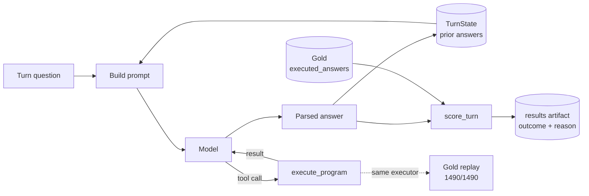

# ConvFinQA Report

*The headers here are guidelines, you can structure your report however you like.*

## Running it

Three paths, in the order a reviewer with no key would want them.

**1. No key — a real conversation, replayed:**

```bash
uv run main chat "Single_SLG/2013/page_133.pdf-4" --client fixture
```

No key, no network. This demonstrates the real questions, the real recorded answers (4 real
values from an earlier real Anthropic call this project made), and the real `chat`/`TurnState`
loop (`chat` calls `turn_state.add()` after every answer regardless of client) — but
**`FixtureClient` is a flat `(record, turn_index)` lookup that ignores `turn_state` on replay
(see its own docstring), so tool routing and the parse-repair path are not exercised by this
demo**, only by the live `--client anthropic` path. What you're seeing is genuine recorded model
output, displayed through the real interface, not a live call and not staged data.

**2. No key — the real pipeline, a known-wrong predictor:**

```bash
uv run main eval --client stub
```

Runs the complete pipeline end to end against the real dataset — loader, program executor,
scorer, denominator — with a predictor that is guaranteed wrong on every turn by construction.
Prints strict/tolerant accuracy (both `0.0`, by design) with their denominator. This is the
harness proving itself, not a demo: `make eval-falsify` runs the same check as part of the gate.
No network call is made.

**3. With a key — a live conversation:**

```bash
uv run main chat <record_id>
```

Walks one record's own questions against the real Anthropic client, one turn at a time (enter to
continue, `exit` to stop). Without a key this fails clean — one line naming the missing variable,
exit 1, no traceback — rather than doing nothing silently or crashing.

To see accuracy on a real sample rather than a single conversation:

```bash
uv run main eval --client anthropic --split train --limit <N>
```

`--limit` is required (real spend is never sized implicitly). `--split dev` additionally requires
`--confirm-dev-run`, since `dev` is measured once, at the end of the engagement, and cannot be
un-spent — see Method for why.

The full gate (`make check`) requires no key and no network.

## Method

The metric was designed and frozen before any model call was made — derived entirely from dev's
own `executed_answers` and `turn_program` fields, zero API spend, zero model in the loop. Four
decisions below, each with what was chosen, what the alternatives were, what the data said, and
what the choice costs.

One turn's path through the system, and the fact the epsilon defence below leans on: the same
`execute_program` that resolves every live `calculate` tool call is also what the 1490-point gold
replay runs (`tests/domain/test_gold_replay.py` imports and calls it directly) — arithmetic never
happens twice, in two implementations that could quietly disagree.



**The tolerance epsilon is 1e-3 relative error, and the number was measured, not picked by
convention.** Recomputing every one of dev's 1486 numeric turns' `turn_program` with an executor
independently proven correct (it reproduces gold on 1490/1490 turns under this same tolerance,
the harness's own falsification-proof) and sweeping the comparison tolerance gives:

| relative epsilon | turns matching gold (of 1486) |
|---|---|
| 0 (exact `==`) | 945 |
| 1e-6 | 1166 |
| 1e-5 | 1317 |
| 1e-4 | 1455 |
| 1e-3 | 1486 (full agreement) |
| 1e-2 | 1486 (unchanged) |

1e-5 was rejected because agreement is still incomplete there: 1317 of 1486 (88.6%), meaning a
tolerance that tight would score 169 turns *wrong* even though a from-scratch executor already
proven correct reproduces gold under a slightly looser comparison — those 169 failures are gold's
own storage precision leaking into the metric, not the executor being wrong. 1e-2 was rejected for
the opposite reason: it accepts exactly zero turns beyond what 1e-3 already accepts — a
ten-times-looser tolerance that changes nothing is not a real choice, it's slack that only makes
the metric look more forgiving than it needs to be. Between those two rejections, the true minimum
epsilon for full agreement — the largest relative error dev's own gold values actually exhibit
against an independently-correct executor — is ~7.4e-4. 1e-3 sits at **1.34x that floor**: a
deliberate margin, close enough to the empirical floor that it's clearly forgiving storage noise
and nothing else, loose enough that it isn't brittle to the next turn that happens to land at
7.41e-4. That margin, not the round number itself, is the actual decision.

**Exact match caps a perfect system at 63.6%, which is why a tolerance is a correction, not
leniency.** Comparing the same recomputed `turn_program` results to `executed_answers` with exact
float equality succeeds on only 945 of 1486 turns (63.6%) — using an executor with no known
errors on this data. A hypothetically perfect answering system, one that derives the
mathematically correct value on every single turn, would still score 63.6% under strict match, not
because it reasoned incorrectly but because gold itself is stored at rounded, inconsistent
precision: 354 of 1486 values (23.8%) need five or more decimal places to represent exactly, so it
isn't even a uniform two-decimal rounding rule that could be special-cased away. Reporting only
exact match would make an unreachable ceiling read as a system failure. This is why the frozen
METRIC reports strict and tolerant side by side rather than picking one — strict stays as the
number a reader can audit against raw storage precision, and tolerant is the number that actually
measures the system rather than the dataset's own recording precision.

**Scale-flip — a predicted value equal to `gold × 100` or `gold ÷ 100`, the ratio-vs-percentage
confusion `divide` invites — was decided strict and distinct: never coerced into a correct answer,
only flagged as a diagnostic.** The alternative was costed, not dismissed by assumption. In the
percentage-convention experiment (N=120 turns, top-level `divide`, `abs(gold) ∈ (0,1]`), 19 of 120
turns (15.8%) under the baseline system prompt were scale-flip. Had both forms been accepted as
correct instead, tolerant accuracy on that filtered sample would have roughly tripled — from 10/120
(8.3%) to 29/120 (24.2%) — without the system doing anything differently. That is what accepting
both forms would have bought: a systematic model bias absorbed into the headline instead of left
visible as an error to fix. And it *is* fixable — a one-line system-prompt change (variant B)
nearly halved the rate on its own, 19/120 to 11/120, a change that would never have been made if
scale-flip had simply been scored correct from the start. Refusing to auto-correct is what made
that fix findable.

The decision costs exposure, and it is stated here rather than left for a reader to work out: 352
of 1486 dev turns (23.7%) — every turn where the top-level operation is `divide` and gold falls in
`(0,1]`, the exact condition under which the confusion is possible — have their correctness riding
entirely on the model getting ratio-vs-percentage framing right, invisible in the headline number
unless the `scale_flip` flag is inspected specifically. 352, not the raw 411-turn `abs(gold) ∈
(0,1]` magnitude bucket, because 59 of those 411 turns have a non-`divide` top-level operation
where the ambiguity cannot occur at all — counting them would overstate the exposure.

**Train and dev split by design, not by convention: iterate on train, report dev exactly once.**
The dataset ships train (3037 records) and dev (421 records) with no third, held-out test split.
The reflex under that constraint is to carve dev in half — an iteration set and a reported set,
both drawn from the same 421 — and that was rejected. Train carries the same fields and the same
gold answers as dev, at seven times the volume, and whether it was safe to iterate on was checked,
not assumed: stripping each document id's `Single_`/`Double_` prefix and `.pdf` suffix and
comparing the two splits' underlying source documents (1588 in train, 218 in dev) found **zero
overlap** — no train document is a dev document under a different question. That fact licenses the
design: prompt iteration, the percentage-convention experiment, the arm-B diagnosis, and the first
real accuracy sample all ran against train, and none of it can have leaked into what dev reports,
because there is nothing shared to leak through. Dev itself is measured exactly once, at the end
of the engagement, behind an explicit `--confirm-dev-run` flag the CLI enforces — the split that
cannot be re-measured once spent is treated as exactly that.
## Error Analysis

**Sample and its limits, stated first.** Everything below is measured against a 47-turn,
12-conversation stratified sample of `train` (session 2, slice 18) — not `dev`. `dev` is measured
exactly once, at the end of the engagement (see Method), and has not been run as of this writing;
this section is the best evidence available before that run, not a substitute for it. Every number
below carries its own denominator and its own sample — treat any figure that doesn't as a defect
in the report, not a smaller number worth omitting.

**Two conversations account for 8 of the 16 incorrect turns (50%) — read the failure count as
conversations, not turns.** `Single_AMT/2010/page_98.pdf-2` is 0/4 correct, wrong on every turn by
a consistent ÷20 unit-scale error; `Single_PNC/2012/page_96.pdf-3` is 1/5 correct, correct only on
its opening literal-lookup turn, then wrong on every subsequent derived turn via a subtraction
computed in the reverse order from gold's sign convention. A per-turn tally reports 16 independent
failures; the data underneath is narrower — two recurring, systematic errors that each happen to
touch nearly every turn of their own conversation. Most write-ups of a number like this report
failure *counts*; the distinction changes what "16 wrong turns" should be read to mean.

Clustered by cause, all 16 read individually (not the machine `reason` field, which only
distinguishes `wrong_value` from `parse_error`):

| Root cause | Count | Share | Example (gold → predicted) |
|---|---|---|---|
| Sign/operand-order flip (subtraction in gold's reverse order) | 5 | 31% | `Single_PNC…-3` t2: `16.0 → -16.0` |
| Unit/scale confusion — one conversation, all 4 turns off by a consistent ÷20 | 4 | 25% | `Single_AMT…-2` t0: `205.4 → 10.27` |
| Scale-flip (×100 percentage form), flagged by the scorer | 2 | 12.5% | `Double_REGN…` t0: `0.13082 → 13.08` |
| `parse_error` — no parseable answer after one repair attempt | 2 | 12.5% | `Double_AAL…` t1: `0.00406 → None` |
| Scale-flip-shaped near-miss, just outside flip-detection tolerance | 1 | 6.25% | `Double_CE…` t2: `0.01176 → 1.18` |
| Literal misread from the document (off-by-one table read) | 1 | 6.25% | `Double_CE…` t1: `85.0 → 86.0` |
| Rounding-precision near-miss (0.21% relative error, just above the 0.1% tolerance) | 1 | 6.25% | `Single_PPG…-4` t1: `-0.02355 → -0.0235` |

At n=16, each cluster is roughly 6 percentage points wide; the two largest clusters are the two
systematic conversations above, not nine independent occurrences spread across nine conversations.

**Overall, on this sample**: strict 25/47 (53.2%), tolerant 31/47 (66.0%) — no turns excluded from
the denominator (`run_eval` asserts the scored count matches the expected count or raises).

**The divide-only subset — n=11, and the confidence interval matters more than the point
estimate.** Filtering to the frozen MOVES definition (top-level `divide`, `abs(gold) ∈ (0,1]`)
gives 11 turns, tolerant accuracy 4/11 (36.4%). At n=11, each turn is 9 percentage points of the
subset; a Wilson 95% confidence interval on 4/11 is approximately **15%–65%** (independently
verified at 15.2%–64.6%). That is wide enough that 36.4% should be read as clearing a
pre-registered falsification threshold — the prediction was that `TurnState` plus the winning
percentage-form convention would move divide-turn accuracy from 17.5% toward a 56% ceiling, and it
did move, 17.5%→36.4% — not as a precise magnitude. One sample at this size establishes a
direction, not a number tight enough to stand alone against a baseline point estimate.

**Against the paper's three claims (FinQA, Section 5.3) — confirmed, refuted, or untested, each
stated on its own rather than assumed:**

1. *"The model excels at number selection questions."* **Directionally consistent, not a clean
   confirmation.** Only 1 of the 16 wrong turns (6.25%) is a pure literal/retrieval miss (the
   table-read error above); the other 15 all require computation. This sample did not compute a
   literal-vs-computed accuracy split across the full 47 turns — only the *failures'* composition
   is known — so this is evidence from the shape of the errors, not a stratified accuracy
   comparison. Worth computing properly against `dev`, where it's a free stratification (the
   METRIC section already names it).
2. *"Later turns... tend to be harder... due to longer reasoning dependencies."* **Untested by
   this sample.** Turn indices are known for the 16 failures but were not systematically recorded
   for the 31 correct turns in this spike, so no by-turn-index accuracy exists to confirm or
   refute this claim here. Stated as a gap, not guessed at — `dev`'s own by-turn-index
   stratification should answer it.
3. *"If the prediction for any turn is wrong, then there is a very minor chance that the
   subsequent turns are correct."* **Consistent with this sample's clustering, but the mechanism
   isn't established.** Both systematic-error conversations show exactly this shape (AMT wrong
   from turn 0 onward; PNC correct once, then wrong on every later turn) — but no tool-call
   transcript was retained for these specific turns, so this sample cannot distinguish genuine
   error propagation (a wrong answer recorded in `TurnState` being reused and compounding) from
   two independently-recurring per-turn bugs (a consistent document misread, a consistent sign
   convention) that happen to produce the same observable pattern. The correlation — 2 of 12
   conversations, 50% of all misses — supports the claim; the causal mechanism the paper describes
   is not confirmed by the data in hand.
## Future Work 
Lorem ipsum dolor sit amet consectetur adipiscing elit
## [may not apply] If & how you've used coding assistants or gen AI tools to help with this assignment 
Please be honest.

Lorem ipsum dolor sit amet consectetur adipiscing elit
