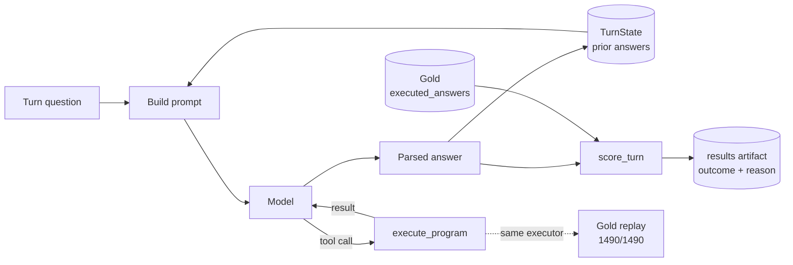

# ConvFinQA Report

A tool-calling conversational agent for ConvFinQA. The model reads the document, works out what
a question refers to, and names the calculation; a deterministic Python tool does the arithmetic.
Arithmetic is externalised deliberately: when an answer is wrong, the failure is in comprehension
or reference resolution, never in the sums.

**Result on the full dev split — 421 conversations, 1,490 turns, scored once:**

| | |
|---|---|
| Tolerant accuracy | **1130/1490 = 75.84%** |
| Strict accuracy | 855/1490 = 57.38% |
| Conversation-level exact match | 271/421 = 64.37% |
| Model | `claude-haiku-4-5-20251001`, temperature 0 |
| Spend | $5.62 (cap $25), 52 minutes wall clock |

For reference, the ConvFinQA paper reports FinQANet at 68.90 and a human expert at 89.44.

Every figure above is reproducible from a committed artifact with `make recompute-dev`.

---

## Running it

**1. No key — a replayed conversation**

```bash
uv run main chat "Single_SLG/2013/page_133.pdf-4" --client fixture
```

No API key, no network. Replays four real answers from an earlier model run through the same
`chat` interface. These are genuine recorded outputs, not invented examples.

Replay mode is a flat lookup by `(record_id, turn_index)`. It does **not** exercise tool routing
or the parse-repair step — only `--client anthropic` does that.

**2. No key — the real pipeline with a predictor built to be wrong**

```bash
uv run main eval --client stub
```

Runs the loader, executor and scorer over the whole train split with a predictor that is wrong on
every turn by construction. Expected accuracy is `0.0`. This is the falsification check: it shows
the scorer can report failure, not only success. `make eval-falsify` runs the same check as part
of the gate.

**3. With a key — a live conversation**

```bash
uv run main chat <record_id>
```

Walks one record's own questions in order. Enter continues, `exit` stops. With no key it prints
one line and exits 1 rather than crashing.

**Accuracy on a sample:**

```bash
uv run main eval --client anthropic --split train --limit <N>
```

`--limit` is always required with a real client, so spend is never sized by accident.
`--split dev` additionally requires `--confirm-dev-run`, because dev is scored once and cannot be
made unseen again.

`make check` runs the full gate with no key and no network. `docs/TESTING.md` records a manual
CLI verification from a fresh clone, including exit codes for every guard.

---

## Method

The scoring metric was designed and frozen **before any model call was made**. Everything used to
define it came from the dev set's own `executed_answers` and `turn_program` fields — no API spend,
no model in the loop. That ordering matters: it means the metric could not be quietly adjusted
later to flatter a result.

### How a turn flows



Three properties of that diagram are load-bearing.

**`TurnState` carries the model's own answers, not gold.** A later turn asking "and what was that
in 2012?" sees what the model actually said, including when it was wrong. Repairing the
conversation with gold between turns would measure a system that could not exist in production,
and would hide error propagation entirely.

**Gold enters only at `score_turn`.** It is never part of a prompt.

**One arithmetic implementation.** The same `execute_program` that serves live `calculate` tool
calls is what the gold replay runs — `tests/domain/test_gold_replay.py` imports and calls it
directly. Replaying all 1,490 dev `turn_program` entries reproduces `executed_answers` on
1,490/1,490 within the frozen tolerance. There is no separate test calculator that could pass
while the production one is broken.

A fuller walkthrough of each stage is in `docs/ARCHITECTURE.md`.

### Why 0.1% relative tolerance

I re-computed every one of dev's 1,486 numeric `turn_program` entries with the executor and swept
the comparison tolerance:

| Tolerance | Turns matching gold (of 1486) |
|---|---:|
| exact (`==`) | 945 |
| 0.0001% | 1166 |
| 0.001% | 1317 |
| 0.01% | 1455 |
| **0.1%** | **1486** |
| 1% | 1486 |

The largest relative difference between a freshly computed answer and its stored gold value is
about **0.074%**. So 0.1% sits just above the observed floor, accepts every valid gold
calculation, and going ten times looser to 1% accepts nothing further. That margin — not the
round number — is the decision.

**Exact match caps a perfect system at 63.6%.** Only 945 of 1,486 turns match gold under exact
float equality, using an executor with no known errors on this data. Gold is stored at
inconsistent precision: 354 of 1,486 values need five or more decimal places to reproduce, so it
is not a uniform two-decimal rounding rule that could be special-cased away. Reporting only exact
match would make a storage artefact look like a model failure.

Both numbers are reported. Strict is auditable against raw storage; tolerant measures the system.

### Ratio versus percentage, and why I refused to accept both

A `divide` result of `0.05` may come back from the model as `5`, read as a percentage. I score
that **wrong** and flag it `scale_flip` rather than accepting either form.

The alternative was costed, not assumed. On a 120-turn train experiment (top-level `divide`, gold
in `(0,1]`), 19 of 120 turns were scale-flips under the original prompt. Accepting both forms
would have moved tolerant accuracy from 10/120 to 29/120 without the system improving at all. It
would also have made the next finding invisible.

**Exposure is 352 of 1,486 dev turns (23.7%)** — turns where the top-level operation is `divide`
and gold falls in `(0,1]`. The raw magnitude bucket holds 411, but 59 of those have a non-`divide`
top-level operation and cannot exhibit the confusion, so 352 is the honest figure.

### A prompt rule I removed

My original system prompt said to report the raw ratio *"unless the question explicitly asks for a
percentage."* That exception is wrong against this benchmark: ConvFinQA gold is a raw ratio even
when the question says "percent". `Single_CME/2010/page_113.pdf-1` turn 1 has gold `0.68381`, not
`68.381`.

Measured from dev gold, no model call: 369 turns have a `divide` producing a value in `(0,1]`, and
**206 of those (55.8%) contain "percent" or "%" in the question**. Under the old instruction all
206 were pushed toward the wrong form — **13.9% of the dev denominator, wrong by construction.**

I re-ran the same paired 120-turn train experiment with the exception removed:

| | old prompt | corrected |
|---|---:|---:|
| Tolerant correct | 21/120 (17.5%) | 36/120 (30.0%) |
| `scale_flip` | 11/120 (9.2%) | 0/120 (0%) |

16 turns moved wrong→right, 1 moved right→wrong; paired significance test `p = 0.000275`. The one
regression is `Single_GS/2018/page_68.pdf-1` turn 4 — gold `0.11873`, model `12.0` — where the
word "percent" still pulled the model toward percentage form.

I would have made this change without the experiment, because the old rule plainly contradicted
the benchmark. The experiment confirmed the size of it.

### Train and dev

The dataset ships train (3,037 records) and dev (421). There is no third held-out split.

The obvious move is to carve dev in half, and I rejected it: that spends half the only genuinely
unseen data during development. Train has the same fields and gold answers at seven times the
volume. Whether it was safe to iterate on was **checked, not assumed** — stripping each id's
`Single_`/`Double_` prefix and `.pdf` suffix gives 1,588 source documents in train and 218 in dev,
with **zero overlap**.

Stated precisely, because "dev untouched" would be too strong:

- I did **not** score model predictions against dev during development.
- I **did** use dev's gold fields to validate the scoring method — the tolerance sweep and the
  gold replay both read dev gold directly. Neither involved a model prediction or any API spend.
- All prompt experiments ran on train.

The final dev run sits behind `--confirm-dev-run` for the reason above.

---

## Results

Full dev, scored once, at commit `e93e7d9` with the gate green before and after:

| Metric | Value |
|---|---|
| Tolerant | 1130/1490 = **75.84%** |
| Strict | 855/1490 = 57.38% |
| Conversation-level exact match | 271/421 = 64.37% |
| Reasons | `ok` 1130 · `wrong_value` 335 · `parse_error` 25 |
| `provider_error` / `timeout` | 0 — retry never had to fall back |
| `scale_flip` | 10 of 1490 (0.67%) |
| Spend | $5.6207 against a $25 cap |
| Wall clock | 3,143s (52.4 min), sequential |

### By turn depth, against the paper's published baselines

Tolerant accuracy per conversation turn (n = 421 per turn for turns 1–5; n = 20 for the 6th):

| Turn | This system | FinQANet | GPT-3 DSL |
|---|---:|---:|---:|
| 1st | 77.7 | 75.58 | 72.81 |
| 2nd | **77.4** | 70.74 | **29.03** |
| 3rd | 74.1 | 66.13 | 56.77 |
| 4th | 74.4 | 63.96 | 33.12 |
| 5th | 70.4 | 63.90 | 45.95 |
| 6th | 75.0 | 34.38 | 25.22 |

The second turn is the interesting one. The paper's own caption on that figure says the second
turn mostly refers back to the first and GPT-3 often fails to understand it — 29.03%. This system
holds at 77.4%, essentially flat from turn 1. That is what explicit `TurnState` buys: reference
resolution is a lookup against recorded state rather than something the model has to re-derive
from the conversation.

### Other stratifications

| Cut | Result |
|---|---|
| Number selection (literal program) | 374/487 = 76.80% |
| Computation (any operation) | 756/1003 = 75.37% |
| 1-step programs | 76.98% |
| 2-step | 74.49% |
| 3+ steps | 68.83% |
| Turns with an internal `#0`/`#1` reference | 73.96% |
| Turns without | 76.67% |
| Type 1 conversations | 823/1052 = 78.23% |
| Type 2 (hybrid) | 307/438 = 70.09% |

Two things stand out. **Accuracy declines monotonically with program depth** — 76.98% → 74.49% →
68.83% — which isolates reasoning length from conversational length. And **number selection is
barely easier than computation**, 76.80% against 75.37%. The paper reports that FinQANet "excels
at number selection questions"; on 487 and 1,003 turns this system shows a 1.4-point gap, which is
not that pattern.

### Reproducing these numbers

Every per-turn outcome is in `results/dev_results.jsonl` — 1,490 lines, one JSON object per turn,
with `record_id`, `turn_index`, `turn_program`, `gold`, `predicted`, `outcome`, `reason` and
`scale_flip`. It was written to disk turn by turn as the run progressed and committed unchanged.

```bash
make recompute-dev
```

recomputes every figure in this section from that file. It imports `score_turn` from
`src/domain/scorer.py` rather than reimplementing the rules, so the reporting script cannot drift
from the evaluator. One cut — type 1 vs type 2 — needs `has_type2_question`, which lives on the
dataset record rather than in the results artifact, so the script joins it on `record_id` from
`data/convfinqa_dataset.json`.

---

## Error analysis

The dev run gives the distribution: of 360 wrong turns, 335 are `wrong_value` and 25 are
`parse_error` — an answer that could not be parsed even after one repair attempt. No turn was
excluded from the denominator; the runner asserts the scored count matches the expected count and
raises if it does not.

The root-cause work below was done **by hand on a 47-turn, 12-conversation train sample** before
the dev run, reading each failing turn individually. It explains failure *modes*; the dev figures
above are the measurement.

### Failures cluster by conversation, not by turn

Two conversations produced 8 of the 16 wrong turns in that sample.

`Single_AMT/2010/page_98.pdf-2` was wrong on all four of its turns, every one off by a consistent
factor of 20. `Single_PNC/2012/page_96.pdf-3` got its opening lookup right and then failed every
derived turn, subtracting in the opposite order from gold.

A per-turn tally reports 16 independent failures. The data underneath is narrower: two systematic
errors, each touching most turns of its own conversation. That distinction changes what the number
means.

| Root cause | Count | Example |
|---|---:|---|
| Sign flip — subtraction reversed | 5 | `Single_PNC…-3` t2: `16.0 → -16.0` |
| Unit/scale error, one conversation ÷20 | 4 | `Single_AMT…-2` t0: `205.4 → 10.27` |
| Scale-flip ×100 | 2 | `Double_REGN…` t0: `0.13082 → 13.08` |
| `parse_error` after one repair | 2 | `Double_AAL…` t1: `0.00406 → None` |
| Scale-flip-shaped near miss | 1 | `Double_CE…` t2: `0.01176 → 1.18` |
| Literal table misread | 1 | `Double_CE…` t1: `85.0 → 86.0` |
| Rounding miss | 1 | `Single_PPG…-4` t1: `-0.02355 → -0.0235` |

At n=16 each failure is roughly 6 percentage points, so these shares are not precise estimates.

The two `scale_flip` failures predate the prompt fix described in Method, and dev's rate is now
0.67%. I did not re-run that specific 47-turn sample afterwards, so I cannot state its updated
accuracy.

### Against the paper's three claims

**"The model excels at number selection questions."** Not confirmed on dev. Literal-program turns
score 76.80% and computation turns 75.37% — a 1.4-point gap on large denominators, not the
pronounced advantage the paper describes.

**"Later turns tend to be harder."** Confirmed, mildly. Dev accuracy declines 77.7% → 70.4% across
turns 1–5, and monotonically by program depth. The decline is far shallower than either published
baseline.

**"A wrong turn makes later turns unlikely to be right."** Consistent with the train sample's
clustering, but not proven. I did not retain per-turn tool-call traces for those conversations, so
I cannot separate genuine propagation — a wrong value in `TurnState` being reused — from a
repeated independent error that produces the same shape. The correlation supports the claim; the
mechanism is not established from data I have.

---

## Limitations

**`scale_flip` detects only ×100 and ÷100.** An early probe had the model answer in millions where
gold was in billions — a ×1000 error, which the detector does not flag and which is
indistinguishable in the headline from any other wrong answer. I did not widen it after one
observation: the 352-turn exposure figure is a frozen metric decision, and changing the rule on a
sample of one would reopen it without knowing how often the broader class occurs.

**No automated check enforces the module layering.** `import-linter` was considered and dropped
for budget, so nothing in `make check` verifies that `src/services` never imports a concrete
`src/adapters` class. That gap produced a real defect: `eval_falsify_check.py` imported
`StubClient` directly. I found it by hand while writing this report, not by review or the gate.
The instance is fixed; the gap remains.

**`eval_runner` reads token counters off `AnthropicClient` that are not declared on the
`ModelClient` protocol.** Harmless with the two clients that exist; a third that did not happen to
match that undeclared shape would silently report zero cost.

**`wrong_operation` is not computed.** Distinguishing "picked the wrong number" from "did the
wrong arithmetic" needs per-turn tool-call traces, which the results artifact does not capture.
The gold `turn_program` field makes this possible; I did not build it.

**The keyless demo covers one conversation.** Enough to show the mechanism, and each additional
one has to be a real recorded conversation rather than invented data.

---

## Future work

Ranked by what most closes the gap to a production system.

1. **Capture tool-call traces and compute `wrong_operation`.** The gold programs are in the
   dataset; this would split the 335 `wrong_value` turns into number-selection failures and
   operation failures, which is the most useful thing still missing from the error analysis.
2. **Investigate the 3+ step decline** (68.83% against 76.98% at one step). Long programs are
   where the system is weakest and the sample is large enough to work on.
3. **Widen unit-error detection beyond ×100**, with a measurement of how often the broader class
   occurs rather than a rule change on a single observation.
4. **Add `import-linter`** to enforce the dependency direction in the gate. Not done here because
   configuring the contract and fixing whatever else it surfaces is real, uncosted work.
5. **Extend the keyless fixture set** to one conversation per turn-count bucket.

Deliberately out of scope, with reasons: retrieval or a vector store (each record ships its own
document, so cross-document retrieval is not the problem this dataset poses, and building one is
the most common way to over-build this task); fine-tuning; DSL program synthesis; multi-agent
orchestration; a web interface; a second provider; persistence between processes. Repository,
Unit of Work, message bus and CQRS are also out — there is no database and no concurrency, so
applying them here would be a scope error rather than sophistication.

---

## Use of AI tools

I built this with **Claude Code**, driven by my own tooling for running coding agents against a
deadline — a pre-tool-use hook, a work ledger, and a checkpoint after each increment. That tooling
lives in a separate private repository and is not part of this submission. `PROCESS.md` has the
full slice-by-slice record and the incidents summarised here.

**What I delegated:** implementation of individual pre-scoped slices — the executor, the scorer,
the Anthropic adapter, CLI wiring, and the tests for each — given an intent, a file list and a
check command.

**What I did not:** the metric itself (the tolerance, the scale-flip policy, the train/dev split —
all decided by me and frozen before any model call existed), the plan and slice sequencing, and
every checkpoint verification. No slice was marked done on a subagent's report; I re-ran the gate
and read the diff before each commit.

**What the controls caught.** A spend guard accepted `--limit -1`, which is Python's
slice-from-the-end rather than "no records" and silently selected nearly the whole train split; an
adversarial review pass found it, I reproduced it live and killed the run after 46 real calls. A
docstring said an exception propagated uncaught after a handler had been added hours earlier,
across a session boundary. A first draft of `eval_runner.py` imported a concrete adapter into the
service layer, caught while reading the diff before checkpointing. An earlier draft of this report
said the keyless demo used "the same tool loop" as the live client, which is false — it is a flat
lookup — and was corrected against the source.

**What went wrong, and was disclosed rather than fixed quietly.** Twice, a subagent's self-reported
slice timings were fabricated — once reconstructed after the fact, once a finish time later than
the next task's start. Both are marked `estimated: true` in the ledger and excluded from timing
figures rather than silently corrected to look like real data. After that, timings came from my
own clock.

**What I can defend line by line:** the executor, the scorer and tolerance policy, the gold replay,
and `TurnState` including its cross-turn error risk. Those I read in full as they landed and wrote
one sentence per decision as I went. The Anthropic adapter's retry and caching plumbing, the CLI
wiring, and most of the test suite I reviewed at checkpoints — diff read, gate re-run, findings
fixed or logged — but not to the same depth. If asked about a specific line I had not traced
myself, I would say so.

**Model choice.** `claude-haiku-4-5-20251001`, temperature 0, version pinned as a literal string.
Because arithmetic is externalised to a deterministic tool, the model's job is comprehension,
reference resolution and choosing an operation — not calculation. The cheapest current-generation
model clears FinQANet's 68.90 on this task for $5.62 across the full dev split. A larger model is
the obvious next experiment; I did not run it, because doing so after the dev measurement would
have meant either reporting a number from a system I had not measured, or spending dev twice.
