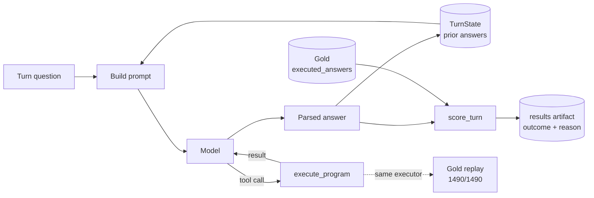

# ConvFinQA Report

I built a tool-calling conversational agent for **ConvFinQA**.

The model:

* reads the financial document
* understands what the question refers to
* decides what calculation is needed

A deterministic Python tool then performs the arithmetic.

This separation is deliberate. The model decides **what maths to do**, while Python **does the maths**. This makes arithmetic predictable and makes failures easier to analyse.

## Full dev result

The dev set was scored **once**:

```text
421 conversations
1,490 turns
```

| Metric                         |                                     Result |
| ------------------------------ | -----------------------------------------: |
| Tolerant accuracy              |                     **1130/1490 = 75.84%** |
| Strict accuracy                |                          855/1490 = 57.38% |
| Conversation-level exact match |                           271/421 = 64.37% |
| Model                          | `claude-haiku-4-5-20251001`, temperature 0 |
| Spend                          |                         $5.62 of a $25 cap |
| Runtime                        |                                 52 minutes |

For comparison, the ConvFinQA paper reports:

```text
FinQANet:     68.90
Human expert: 89.44
```

Every result above can be reproduced from the committed results file with:

```bash
make recompute-dev
```

---

## Running it

### 1. No key: replay a real conversation

```bash
uv run main chat "Single_SLG/2013/page_133.pdf-4" --client fixture
```

This needs:

```text
no API key
no network
```

It replays **4 real answers** from an earlier model run through the same `chat` interface.

These are genuine recorded model outputs, not invented examples.

However, fixture mode is only a lookup using:

```text
(record_id, turn_index)
```

It does **not** run:

* tool routing
* the parse-repair step

Only:

```text
--client anthropic
```

runs the complete live path.

### 2. No key: test the real evaluation pipeline with an intentionally wrong predictor

```bash
uv run main eval --client stub
```

This runs the:

* loader
* executor
* scorer

over the full train split.

The stub predictor is deliberately wrong on every turn, so the expected accuracy is:

```text
0.0
```

That is the point of the test. It proves the evaluation system can correctly report failure rather than always producing a successful-looking score.

The same check is included in:

```bash
make eval-falsify
```

### 3. With a key: run a live conversation

```bash
uv run main chat <record_id>
```

This runs one record's questions in order.

Controls:

```text
Enter = next question
exit  = stop
```

If no API key is available, the command prints one clear error line and exits with:

```text
exit code 1
```

rather than crashing.

### Run an accuracy sample

```bash
uv run main eval --client anthropic --split train --limit <N>
```

`--limit` is required whenever the real model is used.

This means the number of API calls, and therefore spend, must be chosen explicitly.

Running dev requires an additional guard:

```text
--split dev
--confirm-dev-run
```

That exists because dev is intended to be scored once. After model predictions have been compared with dev, it cannot become unseen data again.

## Testing

The complete quality gate runs without an API key or network access:

```bash
make check
```

`docs/TESTING.md` contains the full manual CLI verification from a fresh clone, including the exit codes for each guard condition.


---

## Method

I designed and froze the scoring metric **before making any model calls**.

Everything used to define it came directly from the dev set's own:

```text
executed_answers
turn_program
```

There was **no API spend and no model involved**.

That ordering matters because it prevents the metric from being adjusted later to make the final result look better.

### How one turn works



Three parts of this design are especially important.


### `TurnState` stores the model's answers, not gold answers

Later questions see what the model actually answered earlier.

For example, if a later turn asks:

```text
and what was that in 2012?
```

it sees the model's previous answer, even if that answer was wrong.

I do not replace wrong model answers with gold answers between turns.

Doing that would hide error propagation and measure a system that could not exist in production.

### Gold enters only during scoring

The gold answer is used only here:

```text
score_turn
```

It is never included in the model prompt.

So the model cannot see the answer key.

### The same arithmetic code is used everywhere

The same:

```text
execute_program
```

function is used for:

* live `calculate` tool calls
* the offline gold replay

The test:

```text
tests/domain/test_gold_replay.py
```

imports and calls that exact implementation.

Replaying all **1,490 dev `turn_program` entries** reproduces the stored `executed_answers` on:

```text
1490 / 1490
```

within the frozen tolerance.

So there is no separate test calculator that could pass while the production calculator is wrong.

A fuller explanation is in:

```text
docs/ARCHITECTURE.md
```

## Why I used 0.1% relative tolerance

I recalculated all **1,486 numeric dev `turn_program` entries** and compared them with the stored gold answers at different tolerances.

| Tolerance    | Turns matching gold, of 1486 |
| ------------ | ---------------------------: |
| exact (`==`) |                          945 |
| 0.0001%      |                         1166 |
| 0.001%       |                         1317 |
| 0.01%        |                         1455 |
| **0.1%**     |                     **1486** |
| 1%           |                         1486 |

The largest difference between a freshly calculated answer and the stored gold answer was about:

```text
0.074%
```

So **0.1%** is just above the largest observed difference.

It accepts all **1,486** valid gold calculations.

Making the tolerance ten times larger:

```text
1%
```

does not accept a single extra result.

That is why I chose 0.1%.

### Why exact matching is not enough

Exact float equality only matches:

```text
945 / 1486 = 63.6%
```

even when using an executor with no known errors on this data.

The reason is inconsistent precision in the stored gold answers.

For example:

```text
354 of 1486
```

values need **five or more decimal places** to reproduce exactly.

So this is not simply a two-decimal rounding rule that can be special-cased.

If I reported only exact accuracy, a storage-format difference would look like a model failure.

That is why I report both:

* **Strict accuracy**, exact match against stored gold
* **Tolerant accuracy**, using 0.1% relative tolerance

## Ratio versus percentage

A division may correctly produce:

```text
0.05
```

but the model may answer:

```text
5
```

because it interprets the result as 5%.

I count that as **wrong** and flag it:

```text
scale_flip
```

I do not accept both forms as correct.

### Why I made that decision

I tested **120 train turns** where:

* the top-level operation was `divide`
* gold was in `(0,1]`

Under the original prompt:

```text
19 / 120
```

were scale-flip errors.

If both forms had been accepted as correct, tolerant accuracy would have increased from:

```text
10 / 120
```

to:

```text
29 / 120
```

without the model improving at all.

That would hide a real weakness.

### How many dev turns are exposed to this problem

There are:

```text
352 / 1486 = 23.7%
```

dev turns where:

* the top-level operation is `divide`
* gold is in `(0,1]`

These are the turns where ratio-versus-percentage confusion can happen.

The raw magnitude bucket contains:

```text
411
```

turns.

But:

```text
59
```

of those do not have `divide` as the top-level operation.

So they cannot have this specific error.

That is why the honest exposure figure is:

```text
352
```

not 411.

## A prompt rule I removed

My original prompt said to return the raw ratio:

> unless the question explicitly asks for a percentage.

That rule was wrong for this benchmark.

ConvFinQA sometimes stores the raw ratio even when the question says "percent".

For example:

```text
Single_CME/2010/page_113.pdf-1
turn 1
```

Gold is:

```text
0.68381
```

not:

```text
68.381
```

### How common this was

From dev gold alone, with no model call:

```text
369
```

turns have a `divide` result in `(0,1]`.

Of those:

```text
206 / 369 = 55.8%
```

contain either:

```text
percent
```

or:

```text
%
```

Under the old prompt, all **206** were pushed toward the wrong representation.

That is:

```text
13.9%
```

of the full dev denominator, wrong by construction.

So I removed the exception.

### Result of the corrected prompt

I reran the same **120-turn paired train experiment**.

| Metric           |     Old prompt | Corrected prompt |
| ---------------- | -------------: | ---------------: |
| Tolerant correct | 21/120 = 17.5% |   36/120 = 30.0% |
| `scale_flip`     |  11/120 = 9.2% |       0/120 = 0% |

At the turn level:

* **16** moved from wrong to right
* **1** moved from right to wrong

The paired significance test gave:

```text
p = 0.000275
```

The one regression was:

```text
Single_GS/2018/page_68.pdf-1
turn 4
```

Gold:

```text
0.11873
```

Model:

```text
12.0
```

The word "percent" still pulled the model toward percentage form.

I would have removed the old rule even without this experiment because it directly contradicted the benchmark.

The experiment simply measured how much the correction helped.

## Train and dev

The dataset contains:

```text
train: 3037 records
dev:    421 records
```

There is no third held-out split.

I chose not to split dev in half.

Doing that would use half of the only genuinely unseen data during development.

Train has the same fields and gold answers and is about **seven times larger**.

I also checked whether train and dev share source documents.

After removing the `Single_` / `Double_` prefixes and `.pdf` suffixes:

```text
train source documents: 1588
dev source documents:    218
overlap:                    0
```

So prompt iteration on train does not reuse the same source documents as dev.

### Precisely what dev was used for

It would be inaccurate to say dev was completely untouched.

What I actually did was:

* I **did not** score model predictions against dev during development.
* I **did** use dev gold fields to validate the scoring method.
* The tolerance sweep used dev gold.
* The 1,490-point gold replay used dev gold.
* Neither involved model predictions or API spend.
* All prompt experiments ran on train.

The final dev evaluation is protected by:

```text
--confirm-dev-run
```

because once dev is scored against model predictions, that held-out measurement cannot be made unseen again.


---

## Results

I scored the full dev set **once**, at commit:

```text
e93e7d9
```

The quality gate was green before and after the run.

| Metric                         | Value                                            |
| ------------------------------ | ------------------------------------------------ |
| Tolerant accuracy              | **1130/1490 = 75.84%**                           |
| Strict accuracy                | 855/1490 = 57.38%                                |
| Conversation-level exact match | 271/421 = 64.37%                                 |
| Reasons                        | `ok` 1130 · `wrong_value` 335 · `parse_error` 25 |
| `provider_error` / `timeout`   | 0                                                |
| `scale_flip`                   | 10/1490 = 0.67%                                  |
| Spend                          | $5.6207 of a $25 cap                             |
| Wall clock                     | 3,143s = 52.4 min, sequential                    |

No provider retry had to fall back, and there were no timeout failures.

### Accuracy by conversation turn

Tolerant accuracy by turn:

* turns 1 to 5: `n = 421, 421, 305, 211, 108` respectively
* turn 6: `n = 20`

| Turn | This system | FinQANet | GPT-3 DSL |
| ---- | ----------: | -------: | --------: |
| 1st  |        77.7 |    75.58 |     72.81 |
| 2nd  |    **77.4** |    70.74 | **29.03** |
| 3rd  |        74.1 |    66.13 |     56.77 |
| 4th  |        74.4 |    63.96 |     33.12 |
| 5th  |        70.4 |    63.90 |     45.95 |
| 6th  |        75.0 |    34.38 |     25.22 |

Two deeper turn positions exist in dev, at 3/3 and 0/1. They are omitted here as too small to be meaningful rather than dropped silently. The **second turn** is especially interesting. 

The paper says second-turn questions often refer back to the first turn, and GPT-3 frequently fails to understand that reference. Its second-turn accuracy falls to:

```text
29.03%
```

This system stays at:

```text
77.4%
```

which is almost unchanged from the first-turn result of:

```text
77.7%
```

The main reason is explicit `TurnState`.

Previous model answers are stored and made available to later turns, so the model can resolve references using recorded conversation state rather than reconstructing everything from scratch.

### Other breakdowns

| Group                                     |            Result |
| ----------------------------------------- | ----------------: |
| Number selection, literal program         |  374/487 = 76.80% |
| Computation, any operation                | 756/1003 = 75.37% |
| 1-step programs                           |            76.98% |
| 2-step programs                           |            74.49% |
| 3+ step programs                          |            68.83% |
| Turns with internal `#0` / `#1` reference |            73.96% |
| Turns without internal reference          |            76.67% |
| Type 1 conversations                      | 823/1052 = 78.23% |
| Type 2, hybrid conversations              |  307/438 = 70.09% |

Two results stand out.

### 1. Accuracy drops as programs get longer

Accuracy falls from:

```text
76.98%
```

for **1-step** (408/530) programs, to:

```text
74.49%
```

for **2-step** (295/396) programs, and then:

```text
68.83%
```

for **3+ step** (53/77) programs.

So longer reasoning chains are clearly harder for the system.

This is useful because it separates **calculation depth** from simply being later in a conversation.

### 2. Number selection is only slightly easier than computation

Number-selection accuracy is:

```text
76.80%
```

Computation accuracy is:

```text
75.37%
```

That is only about a **1.4 percentage-point difference** across:

```text
487 number-selection turns
1003 computation turns
```

The FinQA paper says FinQANet "excels at number selection questions".

This system does not show such a strong difference. It performs almost equally on number selection and computation.

## Reproducing the results

Every dev prediction is stored in:

```text
results/dev_results.jsonl
```

The file contains:

```text
1490 lines
```

with one JSON object for every turn.

Each record includes:

```text
record_id
turn_index
turn_program
gold
predicted
outcome
reason
scale_flip
```

The results were written to disk one turn at a time during the dev run and committed unchanged.

To reproduce the reported figures:

```bash
make recompute-dev
```

The script uses the real:

```text
score_turn
```

function from:

```text
src/domain/scorer.py
```

rather than creating a second implementation of the scoring rules.

This means the reporting code uses the same scorer as the actual evaluation.

One breakdown needs extra information.

The **Type 1 vs Type 2** comparison uses:

```text
has_type2_question
```

That field is stored in the original dataset, not in `dev_results.jsonl`.

So the script joins the results back to:

```text
data/convfinqa_dataset.json
```

using:

```text
record_id
```

---

## Error analysis

The final dev run had **360 wrong turns**:

* **335** were `wrong_value`, meaning the model produced a parseable answer but the value was wrong.
* **25** were `parse_error`, meaning no usable answer could be extracted even after **one repair attempt**.

No turns were removed from the denominator. The runner checks that the number of scored turns matches the expected number and raises an error if it does not.

The detailed root-cause analysis below was done manually on a smaller **47-turn, 12-conversation train sample** before the dev run.

So:

* the **dev run measures how often failures happened**
* the **train sample helps explain why they happened**

### Failures cluster by conversation

In the train sample, **2 conversations caused 8 of the 16 wrong turns**.

`Single_AMT/2010/page_98.pdf-2` was wrong on all **4 turns**. Every answer was off by the same factor of **20**.

`Single_PNC/2012/page_96.pdf-3` got the first lookup question right, but every later derived answer was wrong because subtraction was done in the opposite order from gold.

If I only count turns, that looks like **16 separate failures**.

But the underlying picture is narrower: a few systematic mistakes affected several turns in the same conversation.

| Root cause                             | Count | Example                                  |
| -------------------------------------- | ----: | ---------------------------------------- |
| Sign flip, subtraction reversed        |     5 | `Single_PNC…-3` t2: `16.0 → -16.0`       |
| Unit/scale error, one conversation ÷20 |     4 | `Single_AMT…-2` t0: `205.4 → 10.27`      |
| Scale-flip ×100                        |     2 | `Double_REGN…` t0: `0.13082 → 13.08`     |
| `parse_error` after one repair         |     2 | `Double_AAL…` t1: `0.00406 → None`       |
| Scale-flip-shaped near miss            |     1 | `Double_CE…` t2: `0.01176 → 1.18`        |
| Literal table misread                  |     1 | `Double_CE…` t1: `85.0 → 86.0`           |
| Rounding miss                          |     1 | `Single_PPG…-4` t1: `-0.02355 → -0.0235` |

Because there were only **16 failures**, each one represents about **6 percentage points**. These percentages should therefore be treated as rough indicators, not precise estimates.

The **2 `scale_flip` failures** happened before the prompt fix described in Method.

On dev, the `scale_flip` rate is now only **0.67%**.

I did not rerun the exact **47-turn sample** after the prompt change, so I cannot claim what its updated accuracy would be.

## Comparison with the paper's three claims

### 1. "The model excels at number selection questions."

This was **not clearly confirmed on dev**.

Accuracy was:

* **76.80%** on literal-program turns
* **75.37%** on computation turns

That is only a **1.4 percentage-point gap**.

So the system was slightly better at direct number selection, but not by the large margin described in the paper.

### 2. "Later turns tend to be harder."

This was **mildly confirmed**.

Dev accuracy declined from:

```text
77.7% → 70.4%
```

across turns **1 to 5**.

Accuracy also declined consistently as program depth increased.

However, the decline was much smaller than in either published baseline.

### 3. "A wrong turn makes later turns unlikely to be right."

The results are **consistent with this claim, but do not prove it**.

The train sample showed clear clustering, where one mistake was followed by several later failures in the same conversation.

However, I did not retain the detailed tool-call trace for those turns.

So I cannot tell whether:

* a wrong value stored in `TurnState` directly caused the next error, or
* the model independently made the same kind of mistake again

The pattern supports the paper's claim, but the exact cause is not proven by the data I kept.

---

## Limitations

## Limitations

### `scale_flip` only detects ×100 and ÷100

The current `scale_flip` check only catches percentage-style errors such as:

```text
0.05 → 5
```

It does not catch other unit mistakes.

For example, in an early probe the model answered in **millions** when the gold answer was in **billions**. That is a:

```text
×1000
```

error.

The detector does not flag it separately, so it appears as an ordinary wrong answer.

I did not expand the rule after seeing just one example. The **352-turn exposure figure** was already frozen, and changing the rule based on a single case would reopen the metric without knowing how common the wider problem is.

### No automated layering check

`make check` does not currently verify that:

```text
src/services
```

never directly imports a concrete class from:

```text
src/adapters
```

I considered adding:

```text
import-linter
```

but left it out for budget reasons.

This gap caused a real defect.

`eval_falsify_check.py` directly imported:

```text
StubClient
```

I found that manually while writing the report, not through the quality gate.

The specific defect is fixed, but the automated check is still missing.

### Cost reporting is not fully defined by the interface

`eval_runner` reads token counters directly from:

```text
AnthropicClient
```

but those fields are not declared on the:

```text
ModelClient
```

protocol.

This is harmless with the **2 current clients**.

However, a third client with a different structure could silently report:

```text
0 cost
```

instead of failing clearly.

### `wrong_operation` is not calculated

The current results cannot cleanly distinguish between:

* choosing the wrong number
* choosing the wrong arithmetic operation

To do that, I would need to save the model's tool-call trace for each turn.

The dataset already provides the gold:

```text
turn_program
```

so the comparison is possible, but I did not build that feature.

### The keyless demo covers one conversation

The keyless fixture currently contains:

```text
1 conversation
```

That is enough to demonstrate how the replay mechanism works.

I did not add more because every extra fixture should come from a **real recorded conversation**, rather than invented example data.


---

## Future work

## Future work

Ranked by what would move the system closest to production.

1. **Capture tool-call traces and add `wrong_operation`**

   The dataset already contains the gold programs.

   This would let me split the **335 `wrong_value` turns** into:

   * wrong number selected
   * wrong operation chosen

   That is the biggest missing piece in the current error analysis.

2. **Investigate the decline on programs with 3+ steps**

   Accuracy falls to:

   ```text
   68.83%
   ```

   compared with:

   ```text
   76.98%
   ```

   for one-step programs.

   Longer calculations are where the system is weakest, and the sample is large enough to investigate properly.

3. **Detect more unit errors**

   The current check mainly catches:

   ```text
   ×100 / ÷100
   ```

   such as ratio-versus-percentage mistakes.

   I would extend this to other scale errors, but only after measuring how often they actually occur.

4. **Add `import-linter`**

   This would automatically enforce the intended dependency direction in the quality gate.

   I did not add it here because configuring the rules and fixing any additional violations it finds would be real, unplanned work.

5. **Expand the keyless fixture set**

   Add at least one recorded conversation for each turn-count bucket.

   This would make the no-key demo more representative without requiring network access.

## Deliberately out of scope

I intentionally did not add:

* retrieval or a vector store
* fine-tuning
* DSL program synthesis
* multi-agent orchestration
* a web interface
* a second model provider
* persistence between processes

Retrieval is unnecessary here because each record already includes the document needed to answer its questions. Cross-document search is not the problem ConvFinQA is testing.

I also left out:

* Repository pattern
* Unit of Work
* message bus
* CQRS

There is no database and no concurrency in this project, so adding those patterns would increase complexity without solving a real problem.


---

## Use of AI tools

## AI-tool disclosure

I built this with **Claude Code**, supported by my own tooling for running coding agents against a deadline.

That tooling includes:

* a pre-tool-use hook
* a work ledger
* a checkpoint after each increment

The tooling lives in a separate private repository and is not part of this submission.

`PROCESS.md` contains the full slice-by-slice record and the incidents summarised below.

### What I delegated

I delegated individual, pre-scoped implementation slices, including:

* the executor
* the scorer
* the Anthropic adapter
* CLI wiring
* tests for each slice

Each subagent received:

* a clear intent
* a limited file list
* a check command

### What I kept under my control

I did not delegate the core evaluation decisions:

* the tolerance
* the `scale_flip` policy
* the train/dev split
* the overall plan
* the order of the slices
* checkpoint verification

These decisions were made and frozen **before any model call**.

I also did not mark a slice complete just because a subagent said it was done.

Before every commit, I:

* reran the full quality gate
* read the diff
* fixed or recorded any problems

### What the controls caught

The process caught several real problems.

**1. `--limit -1` bypassed the spend guard**

A guard accepted:

```text
--limit -1
```

In Python, that does not mean "run no records". It can slice from the end and therefore selected nearly the whole train split.

An adversarial review found the problem.

I reproduced it and stopped the run after:

```text
46 real calls
```

before fixing the guard.

**2. An outdated docstring**

A docstring said an exception would always propagate uncaught.

A handler had been added several hours later, across a session boundary, but the docstring had not been updated.

**3. A layering violation**

An early version of:

```text
eval_runner.py
```

directly imported a concrete adapter into the service layer.

I caught this while reading the diff before checkpointing.

**4. An incorrect report claim**

An earlier draft said the keyless demo used:

> "the same tool loop"

as the live client.

That was incorrect.

The keyless demo is a **flat lookup of recorded answers**. It does not exercise the live tool-routing loop.

I checked the source and corrected the report.

### What went wrong with timing records

Twice, a subagent reported incorrect slice timings.

In one case, the time had been reconstructed afterwards.

In another, the reported finish time was later than the start of the next task.

I did not silently replace those values.

Both entries are marked:

```text
estimated: true
```

and excluded from the timing figures.

After that, I recorded timings using my own clock.

### What I can defend line by line

The parts I read most deeply and can explain line by line are:

* the executor
* the scorer
* the tolerance policy
* the gold replay
* `TurnState`
* the cross-turn error risk

I read those fully as they landed and recorded the reasoning behind each important decision.

I also reviewed:

* the Anthropic adapter's retry and caching logic
* CLI wiring
* most of the test suite

but not to the same depth.

For those areas, I reviewed the diff, reran the gate, and fixed or logged problems at checkpoints.

If asked about a specific line I had not personally traced, I would say so rather than pretend otherwise.

## Model choice

I used:

```text
claude-haiku-4-5-20251001
```

with:

```text
temperature = 0
```

and pinned the model version as a literal string.

Arithmetic is handled by a deterministic external tool, so the model's main jobs are:

* understanding the question
* resolving references to earlier turns
* finding the relevant numbers
* choosing the correct operation

The model is **not responsible for doing the arithmetic itself**.

This model beat FinQANet's **68.90** benchmark on the task while costing **$5.62** for the full dev split.

A larger model would be the obvious next experiment.

I did not run one after the dev evaluation because that would have meant either:

* reporting results for a system I had not measured, or
* running dev a second time after it had already been used.
