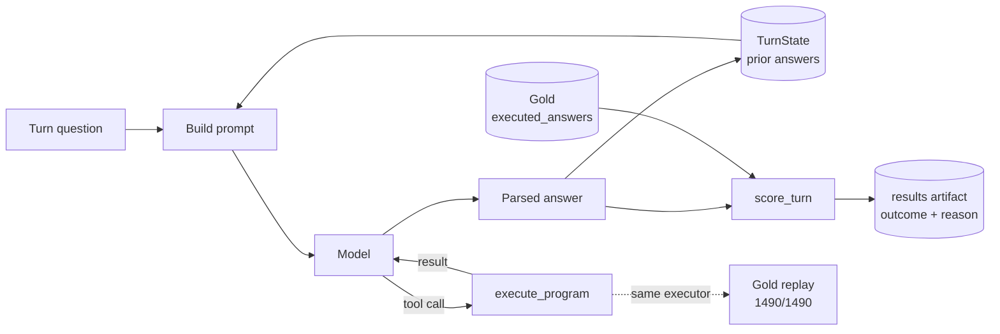

# Architecture

A stage-by-stage walkthrough of how one turn is answered and scored. `REPORT.md` covers the
decisions and the results; this file covers the mechanics.



## 1. The question

The current turn's question, taken from the record's own `conv_questions`. Questions routinely
depend on earlier turns — from `Single_SLG/2013/page_133.pdf-4`:

```
turn 0: what was the total, in millions, capitalized to assets associated with compensation
        expense ... in the year of 2013?
turn 1: and what was it in 2012, also in millions?
turn 2: what was, then, in millions, the total sum that was capitalized in those two years?
turn 3: including the year of 2011, what would then be the total sum capitalized in the three
        years, in millions?
```

Turn 1 has no subject of its own. Turn 2 refers to both prior answers. Turn 3 builds on turn 2's
derived value while pulling a new figure from the document.

## 2. `TurnState`

`TurnState` holds the model's own prior answers for the conversation. For the record above it
accumulates `4.5`, `4.1`, `8.6`, `12.0` as the turns complete.

It stores **what the model predicted, not the gold answer**. If the model had answered turn 0
wrongly, turn 2 would see the wrong value and compound it — which is what a production system
would do. Repairing the conversation with gold between turns would measure a system that cannot
exist, and would hide error propagation entirely.

`TurnState.add()` accepts a float or exactly `yes`/`no`; anything else raises at write time, so a
malformed value cannot enter the conversation and poison a later turn.

## 3. Building the prompt

```
system instructions
+ the document (pre_text, table, post_text)
+ prior turns' questions and the model's own answers
+ the current question
```

The document repeats across every turn of a conversation, so it is sent under prompt caching.

## 4. The model

The model is responsible for comprehension, not arithmetic. Its job is to understand the question,
locate the relevant figures in the table or text, resolve what a phrase like "those two years"
refers to, decide which operation applies, and call the calculator.

## 5. `execute_program`

The deterministic arithmetic layer, exposed as a `calculate` tool. It implements exactly six
operations — the full vocabulary present in the dataset's `turn_program` field:

| Operation | Occurrences in dev |
|---|---:|
| `subtract` | 686 |
| `divide` | 556 |
| literal (no operation) | 487 |
| `add` | 235 |
| `multiply` | 100 |
| `greater` | 4 |

It also resolves within-turn references. A single turn's program can chain steps and refer to
earlier results by position:

```
subtract(17.84, 4.11), subtract(60.15, 41.30), greater(#0, #1)
```

457 of 1,490 dev turns contain such a reference. This is a **different** reference system from
cross-turn dependency, and the two are kept separate: `#0`/`#1` are the executor's job, prior-turn
answers are `TurnState`'s.

## 6. The tool loop

The tool result returns to the model, which then produces its final answer. Iterations are capped;
behaviour at the cap is defined rather than left to run away.

## 7. Parsing

The model finishes with a line of the form `ANSWER: <value>`. The parser extracts the value; that
is the prediction. A reply that does not conform gets exactly one repair attempt with an explicit
instruction. If it still does not parse, the turn scores `parse_error` — 25 of 1,490 dev turns
ended this way.

## 8. Gold

`executed_answers[i]` from the dataset. Note this is the scoring target, not `conv_answers` — the
first is the executed result (`35.8`), the second the original text (`'35.80'`).

Gold is never part of a prompt. It enters the system only at `score_turn`.

## 9. `score_turn`

Compares prediction against gold and returns an outcome and a reason. It applies the frozen 0.1%
relative tolerance, checks the ratio-versus-percentage case and flags `scale_flip` without ever
accepting it as correct, and handles `yes`/`no` as strings rather than coercing them to floats.

Reasons: `ok`, `wrong_value`, `parse_error`, `provider_error`.

## 10. The results artifact

Every turn is recorded, not just the aggregate:

```
record_id, turn_index, turn_program, gold, predicted, outcome, reason, scale_flip
```

Written and flushed as the run progresses, so a crash leaves a truncated-but-valid file rather
than nothing. This is what makes error analysis possible — the difference between "how many
failed" and "why".

## 11. Back into `TurnState`

The parsed prediction is appended, becoming context for the next turn. Gold is never inserted.

## 12. Gold replay — the offline validation

Separate from answering. The dataset already contains every turn's program and its expected
result, so those programs can be executed directly and compared:

```
turn_program            executed_answers
subtract(60.94, 25.14)  →  35.8
```

All 1,490 dev turns reproduce within the frozen tolerance. Because this uses the **same**
`execute_program` the live tool calls, it validates the arithmetic the agent actually uses — not a
parallel test implementation that could pass while production is broken.

The comparison runs through `score_turn`, the production scoring path, so the replay proves the
scorer too. A second assertion pins the exact-match count at 945/1486: the tolerant check would
stay green if the executor silently changed, but the exact count would move.

## Layering

```
cli → adapters → services → domain
```

`domain` holds the record models, the executor and the scorer — no SDK, no network, no clock.
`services` holds the conversation loop, `TurnState` and the eval runner, depending on a
`ModelClient` protocol rather than any concrete client. `adapters` is the only layer importing the
Anthropic SDK, and also holds the fixture and stub clients and the response cache. `cli` is wiring
only.

Adapters sit above services because they implement ports that services declares. Nothing in the
gate currently enforces this — see Limitations in `REPORT.md`.
